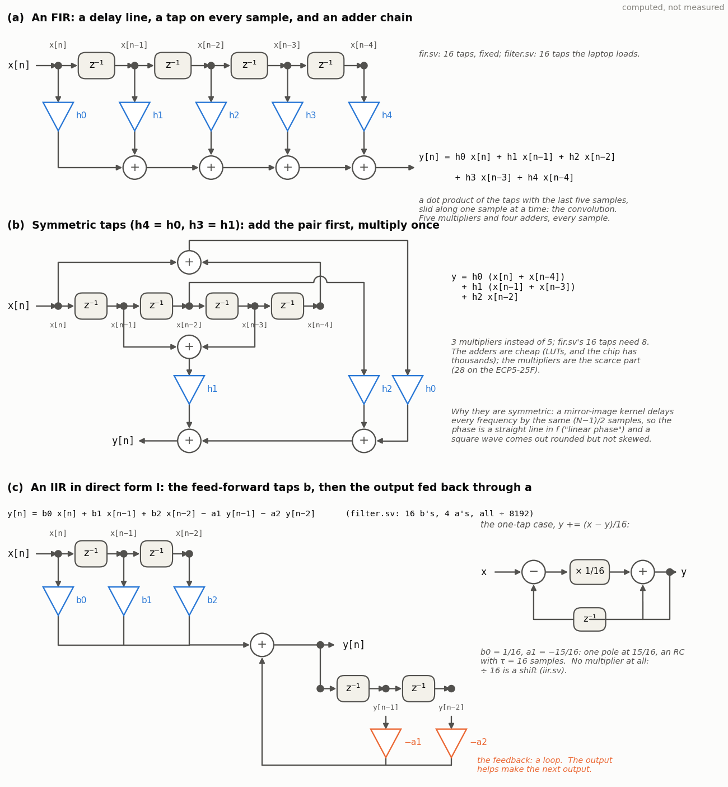

<!-- nav -->
[← 7.00 Signal processing in gateware](7_00_signal_processing_in_gateware.md#700-signal-processing-in-gateware) &emsp;&emsp;&emsp; **[Contents](../README.md#contents)** &emsp;&emsp;&emsp; [7.02 IIR filters: feedback, and an RC in one line →](7_02_iir_filters.md#702-iir-filters-feedback-and-an-rc-in-one-line)

# 7.01 FIR filters: the sliding dot product


A digital filter is a dot product that slides. Take the last *N* samples,
multiply each by a number, add them up, and that is the output for this
sample; next sample, shift everything along one and do it again:

  *y*[*n*] = Σ<sub>*k*</sub> *h*[*k*] *x*[*n* − *k*].

The numbers *h*[*k*] are the *taps*, and because the output depends only
on a finite stretch of the input the thing is a *finite impulse
response* filter, an FIR. Everything a filter does is in the shape of
its taps, and the three shapes in the figure are most of what you will
ever need to know about them.

- **A slowly varying hump** is a moving average with manners. Sixteen
  taps of 1/16 are the plain moving average: every edge becomes a ramp 16
  samples long, and the frequency response is a [sinc](https://en.wikipedia.org/wiki/Sinc_function) with nulls at
  multiples of *f*<sub>s</sub>/16 = 1.56 MHz, so some frequencies vanish and
  the ones between them leak through at −13 dB. Shape the hump as a
  *windowed sinc* (the inverse transform of the brick wall you wanted,
  truncated to 15 taps and tapered with a Hamming window) and for the
  same cost you get a flat passband, −6 dB at the cutoff, and a stopband
  that falls off a cliff: a sophisticated moving average, which is what
  "low-pass filter" usually means.
- **Rapidly changing taps** detect edges. [−1 2 −1] is the second
  difference: a ramp gives zero, a flat top gives zero, and only the
  corners and the noise get through, with a response 4 sin<sup>2</sup>(π*f*/*f*<sub>s</sub>)
  that rises as *f*<sup>2</sup> and reaches +12 dB at *f*<sub>s</sub>/2. It is a
  high-pass, and in an image it would draw the outlines.
- **A symmetric kernel has linear phase.** If *h*[*k*] = *h*[*N* − 1 − *k*],
  every frequency is delayed by the same (*N* − 1)/2 samples, so a square
  wave comes out rounded but not skewed. That is the FIR's great virtue
  over the analog filters of [4.02](4_02_rc_and_lc_circuits.md#402-rc-and-lc-circuits),
  which cannot do it, and it is why anything whose *shape in time*
  matters (pulses, edges, [6.01](6_01_eye_diagrams.md#601-eye-diagrams-and-pulse-shaping)'s
  matched filter) is an FIR with symmetric taps. Its only sin is cost:
  *N* multiplies per sample.

The fourth row of the figure is an IIR, the subject of
[7.02](7_02_iir_filters.md#702-iir-filters-feedback-and-an-rc-in-one-line);
it is there so you can see that a one-line feedback loop does what an RC
does, which an FIR can only approximate with a long tail of taps.



## The same thing in gateware

`fir.sv` is the whole idea in a hundred lines. The ADC is sampled at
25 MS/s as [5.07](5_07_radio_link.md#507-a-radio-link)'s radio does it; a
delay line of *N* registers shifts on every sample; because every tap set
here is symmetric, the mirrored pairs are added first and multiplied
once (8 multipliers for 16 taps instead of 16); the products are summed,
shifted right by 8 (the taps are integers times 256), and the DAC plays
128 plus the result, clipped. Each stage is a register that changes once
per sample, so the DAC holds a clean value for the sample's two clocks. A
parameter picks the taps:

| `SET` | taps | what it is | multipliers |
| --- | --- | --- | --- |
| 0 | sixteen 16s (÷256 = 1/16 each) | the moving average | 0: ×16 is a shift |
| 1 | `[0 0 3 9 20 32 42 46 42 32 20 9 3 0 0]` | `firwin(15, 2e6, fs=25e6)` × 256: the windowed-sinc low-pass at 2 MHz | 5 |
| 2 | `[−256 512 −256]` | the edge detector | 0: shifts again |
| 3 | `[2 6 4 −17 −42 −25 37 73 37 −25 −42 −17 4 6 2]` | `firwin(15, [3e6, 5e6], pass_zero=False)`: a band-pass | 6 |

Yosys turns a multiply by a power of two into wiring, which is why the
moving average and the edge detector cost no multiplier at all, and why
engineers love coefficients like 1/16.

<details>
<summary>The whole file: <code>fir.sv</code></summary>

<!-- file: src/dsp/fir.sv -->
```systemverilog
// fir.sv -- a fixed FIR filter between the ADC and the DAC (7.01).  Every ADC sample
// (25 MS/s) goes into a delay line; the output is a weighted sum of the last N samples,
// and the DAC plays it, once per ADC sample, as 128 + y, clipped to 0..255.
//
//     y[n] = h[0] x[n] + h[1] x[n-1] + ... + h[N-1] x[n-N+1]
//
// That sum is a convolution: a dot product of the taps h with the last N samples, slid
// along the signal one sample at a time.  The taps are fixed when the design is built,
// by SET (make fir_set1.bit):
//
//   SET 0  a 16-sample moving average: every tap 1/16.  The "slowly varying hump".
//   SET 1  a 15-tap windowed-sinc low-pass, 2 MHz cutoff: a sophisticated moving average.
//   SET 2  an edge detector, [-1, 2, -1]: the second difference, a high-pass.
//   SET 3  a 15-tap windowed-sinc band-pass, 3-5 MHz.
//
// The taps are integers x 256 (256 means 1.0), so the sum is divided by 256 at the end:
// a shift right by 8.  All four sets are symmetric, h[k] = h[N-1-k], so the two samples
// that share a tap are added first and multiplied once: 8 multiplies for 16 taps, not
// 16.  (Symmetric taps are also why these filters have a linear phase: every frequency
// comes out delayed by the same (N-1)/2 samples.)
//
// LEDs: led[4] = the output clipped in the last 84 ms; led[3:1] = |y| on a 3-bit scale
//       (a 16-code change lights one more); led[0] blinks: the design is alive.
module fir #(
    parameter integer SET = 1       // which taps: 0 average, 1 low-pass, 2 edge, 3 band-pass
) (
    input  logic       clk,         // 50 MHz
    output logic [7:0] dac_d = 128,
    output logic       dac_clk,
    input  logic [7:0] adc_d,
    output logic       adc_clk,
    output logic [4:0] led
);
    // ---- the taps, as integers x 256 ------------------------------------------------
    // SET 1 and 3 came from scipy (each list is h[0] .. h[N-1]; being symmetric, it reads
    // the same backwards):
    //   python3 -c "import numpy as np, scipy.signal as s
    //   print(np.round(256 * s.firwin(15, 2e6, fs=25e6)).astype(int))"
    //                               -> [0 0 3 9 20 32 42 46 42 32 20 9 3 0 0]
    //   print(np.round(256 * s.firwin(15, [3e6, 5e6], pass_zero=False, fs=25e6)).astype(int))"
    //                               -> [2 6 4 -17 -42 -25 37 73 37 -25 -42 -17 4 6 2]
    // (firwin's default Hamming window; the low-pass's outer taps round to 0, so it is
    // really an 11-tap filter.)  Yosys has no unpacked-array parameters, so the table is
    // one long word, 16 bits per tap, read by h(k) below.
    localparam integer N = (SET == 0) ? 16 : (SET == 2) ? 3 : 15;      // how many taps
    localparam logic [16*16-1:0] TAPS =
        (SET == 0) ? {16{16'd16}} :                                     // 16 x 1/16
        (SET == 1) ? {16'(0), 16'(0), 16'(3), 16'(9), 16'(20), 16'(32), 16'(42), 16'(46),
                      16'(42), 16'(32), 16'(20), 16'(9), 16'(3), 16'(0), 16'(0)} :
        (SET == 2) ? {16'(-256), 16'(512), 16'(-256)} :                 // [-1 2 -1] x 256
                     {16'(2), 16'(6), 16'(4), 16'(-17), 16'(-42), 16'(-25), 16'(37), 16'(73),
                      16'(37), 16'(-25), 16'(-42), 16'(-17), 16'(4), 16'(6), 16'(2)};
    function automatic logic signed [15:0] h(input integer k);        // tap k, x 256
        h = TAPS[16*k +: 16];
    endfunction

    // ---- the ADC at 25 MS/s, as in capture.sv ---------------------------------------
    logic adc_clk_r = 0, new_sample = 0;
    logic signed [8:0] x = 0;                       // the sample, -128..127
    always_ff @(posedge clk) begin
        adc_clk_r  <= ~adc_clk_r;
        new_sample <= 0;
        if (adc_clk_r == 0) begin
            x <= $signed({1'b0, adc_d}) - 9'sd128;
            new_sample <= 1;
        end
    end
    assign adc_clk = adc_clk_r;

    // ---- the delay line: the last N samples, newest first ----------------------------
    logic signed [8:0] d [0:N-1];
    initial for (int k = 0; k < N; k++) d[k] = 0;
    always_ff @(posedge clk)
        if (new_sample) begin
            // ######################################################################
            // ##  KEY LINE: the delay line.  Each new sample pushes the older ones
            // ##  along by one: d[k] is the sample from k samples ago.
            // ######################################################################
            d[0] <= x;
            for (int k = 1; k < N; k++) d[k] <= d[k-1];
        end

    // ---- the sum of products, as an assembly line: one step per clock ----------------
    // A sample lasts two clocks and each step is registered, so each stage changes once
    // per sample and the DAC sees a clean value.  Step 1 pairs the samples that share a
    // tap; step 2 multiplies; step 3 adds up.
    localparam integer M = N / 2;                   // pairs; an odd N leaves a middle sample
    logic signed [9:0]  pair [0:M-1];               // d[k] + d[N-1-k]
    logic signed [8:0]  mid = 0;                    // d[M], when N is odd
    logic signed [25:0] prod [0:M];                 // pair[k] x h(k); prod[M] is the middle's
    logic signed [31:0] sum, acc = 0;
    initial for (int k = 0; k < M; k++) begin pair[k] = 0; prod[k] = 0; end
    initial prod[M] = 0;
    always_comb begin
        sum = 0;
        for (int k = 0; k <= M; k++) sum += prod[k];
    end
    always_ff @(posedge clk) begin
        for (int k = 0; k < M; k++) pair[k] <= d[k] + d[N-1-k];     // the symmetric trick
        mid <= d[M];
        // ##########################################################################
        // ##  KEY LINE: multiply-accumulate.  Each pair times its tap (a hardware
        // ##  multiplier each), then all the products added: the dot product.
        // ##########################################################################
        for (int k = 0; k < M; k++) prod[k] <= pair[k] * h(k);
        prod[M] <= (N % 2 == 1) ? mid * h(M) : 26'sd0;
        acc     <= sum;
    end

    // ---- the output: divide by 256 (the taps' scale), clip to what the DAC can show ---
    logic signed [31:0] y;
    assign y = acc >>> 8;
    always_ff @(posedge clk)
        // ##########################################################################
        // ##  KEY LINE: the taps were x 256, so the sum is y x 256: shift it back,
        // ##  and the DAC plays 128 + y, held until the next sample.
        // ##########################################################################
        dac_d <= (y > 127) ? 8'd255 : (y < -128) ? 8'd0 : 8'(y + 128);
    assign dac_clk = ~clk;

    // ---- LEDs ------------------------------------------------------------------------
    logic [21:0] clip_timer = 0;                    // holds the clip LED on for 2^22 clocks
    logic [25:0] blink = 0;
    logic [7:0]  mag;                               // |y| as the DAC shows it, 0..128
    assign mag = dac_d[7] ? dac_d - 8'd128 : 8'd128 - dac_d;
    always_ff @(posedge clk) begin
        blink <= blink + 1;
        if (y > 127 || y < -128) clip_timer <= '1;
        else if (clip_timer != 0) clip_timer <= clip_timer - 1;
    end
    assign led = {clip_timer != 0, mag[6:4], blink[25]};
endmodule
```

</details>

```console
$ cd src/dsp
$ make sim-fir                 # iverilog: an impulse through each tap set
$ make fir_set1.bit            # or fir_set0, fir_set2, fir_set3
$ make load-fir_set1
```

The simulation plays one sample of +64 into each filter and prints what
the DAC does: the taps come out, scaled by 64/256, three samples later
(`SET` 2 gives `−64 127 −64`, the 128 clipped). That is the first fact
about an FIR made visible: **the [impulse response](https://en.wikipedia.org/wiki/Impulse_response) is the taps.**

## On the oscilloscope


With the ADALM2000's W1 playing a 300 kHz square wave into ADC IN and its
scope on DAC OUT (the first of [7.00](7_00_signal_processing_in_gateware.md#700-signal-processing-in-gateware)'s
three ways), each bitstream in turn shows its character: the moving
average's ramps are exactly 16 samples, 640 ns, long; the windowed sinc
rounds the corners and rings a little, as a filter with a sharp cutoff
must (the ring *is* the sinc's sidelobes, in time); the edge detector
outputs a positive spike at each rising edge and a negative one at each
falling edge and nothing between; and the one-pole of
[7.02](7_02_iir_filters.md#702-iir-filters-feedback-and-an-rc-in-one-line)
charges like a capacitor. The frequency responses of the same four
filters, swept with the generator through
[7.03](7_03_a_filter_you_can_load.md#703-a-filter-you-can-load)'s loadable
version, agree with scipy's prediction to a quarter of a decibel.

## What it costs, and what it buys

An FIR costs *N* multiplies per sample. With two clocks per ADC sample and
28 hardware multipliers on this ECP5, the budget is *N* × *f*<sub>s</sub> ≤ 2 × 28 ×
25 MS/s: about 56 taps at the full rate, or thousands at audio rates with
one multiplier doing them all in turn, which is how a $2 audio codec runs
a 128-tap filter. The symmetric trick halves it. What you buy is a filter
whose response is exactly what you designed, whose phase is a straight
line, which cannot oscillate, which never needs more bits than its
inputs plus a few for the sum, and whose impulse response you can read
off the taps. The one thing it cannot do cheaply is a long memory: an RC
with a 1 ms time constant at 25 MS/s is an impulse response 100,000
samples long, and that is where [7.02](7_02_iir_filters.md#702-iir-filters-feedback-and-an-rc-in-one-line)
comes in.

PySDR's [filters chapter](https://pysdr.org/content/filters.html) covers
the same ground in numpy, with the design side (windowing, the
transition width 3.3 *f*<sub>s</sub>/*N*) that this page only gestures at;
[7.03](7_03_a_filter_you_can_load.md#703-a-filter-you-can-load) uses
scipy's `firwin` and lets you load the result.

**Try this:**

- `SET` 0 with 8 taps, then 32: the ramps halve and double, the first
  null moves to 3.1 MHz and 780 kHz. Build both (`fir_set0` with `N`
  changed) and look.
- Put the band-pass (`SET` 3) on the square wave: a 300 kHz square wave
  has odd harmonics at 900 kHz, 1.5 MHz, …; which ones come through, and
  at what amplitude? Check against the [Fourier series](https://en.wikipedia.org/wiki/Fourier_series).
- An FIR that is *not* symmetric: `[1 −1]` (the first difference) against
  `[−1 2 −1]`. Measure the phase with the scope's second channel, or
  with `filter.py --m2k --ch2` in [7.03](7_03_a_filter_you_can_load.md#703-a-filter-you-can-load).
- Write a 7-tap filter by hand that passes 1 MHz and blocks 3 MHz, then
  see what `firwin` would have chosen and why it does better.
