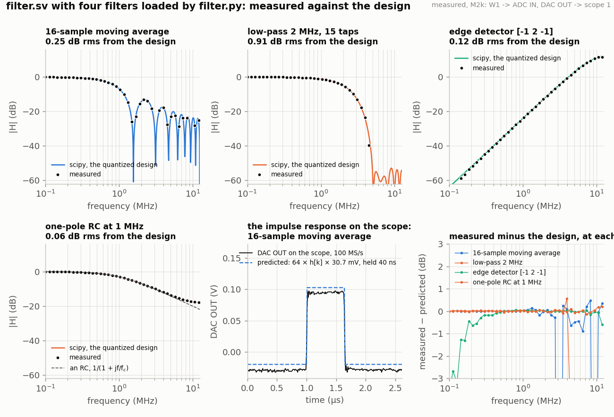

<!-- nav -->
[← 7.01 FIR filters: the sliding dot product](7_01_fir_filters.md#701-fir-filters-the-sliding-dot-product) &emsp;&emsp;&emsp; **[Contents](../README.md#contents)** &emsp;&emsp;&emsp; [7.03 A filter you can load →](7_03_a_filter_you_can_load.md#703-a-filter-you-can-load)

# 7.02 IIR filters: feedback, and an RC in one line



[7.01](7_01_fir_filters.md#701-fir-filters-the-sliding-dot-product)'s filters
look only at the input. Let the output look at *itself* and the whole
character changes:

  *y*[*n*] = *y*[*n* − 1] + (*x*[*n*] − *y*[*n* − 1]) / 2<sup>*K*</sup>.

Each sample, the output moves a fraction 1/2<sup>*K*</sup> of the way toward
the input. That is a capacitor charging through a resistor, *RC* d*V*/d*t*
= *V*<sub>in</sub> − *V*, discretized with one sample as the time step and τ =
2<sup>*K*</sup> samples: the [impulse response](https://en.wikipedia.org/wiki/Impulse_response) is a decaying exponential (1/16)(15/16)<sup>*k*</sup>,
the step response is 1 − *e*<sup>−*t*/τ</sup>, and the frequency response is within
half a decibel of a real RC's 1/(1 + *jf*/*f*<sub>c</sub>) with *f*<sub>c</sub> =
*f*<sub>s</sub>/(2π 2<sup>*K*</sup>), 249 kHz at *K* = 4, out to eight times the
cutoff. It costs one register and a shift. Its impulse response is
infinitely long, which is the name: an *infinite impulse response*
filter, an IIR. The bargain is an RC for the price of one tap; the fine
print is the rest of this page.

<details>
<summary><b>Detail:</b> where the digital RC and the real one part company</summary>

Above about eight times the cutoff the digital one-pole stops falling:
at *f*<sub>s</sub>/2 the real RC is 4 dB lower. The digital filter's response is
α/|1 − (1 − α)*e*<sup>−*jω*</sup>|, with α = 1/2<sup>*K*</sup>, and *e*<sup>−*jω*</sup> goes
round a circle while 1/(1 + *jf*/*f*<sub>c</sub>) keeps going down a line: every
digital filter's response is periodic in *f*<sub>s</sub>, so it has to level off
on the way to *f*<sub>s</sub>/2 and come back up. The RC's response at *f*<sub>s</sub>/2
and beyond is also where the ADC aliases, so in practice the two are
never compared there; but a student who expects −20 dB per decade for
ever will be surprised, and the measured points in the figure show the
flattening from 2 MHz up.

</details>

## The one-pole and a resonator, in gateware

`iir.sv` has two modes. Mode 0 is literally the line above, with one
refinement that is the first lesson of IIR filters: the state *y* is kept
with `GUARD` extra bits below the ADC's least significant bit, and only
the output is rounded. Mode 1 is a second-order *resonator*, a band-pass
whose two poles sit at a radius *r* and angle ±ω<sub>0</sub> inside the unit
circle; its coefficients come from scipy's `iirpeak` for a centre
frequency and a *Q*, and `iir.sv` computes them at build time from the
parameters, so `make iir_peak F0=2e6 Q=10` is a 2 MHz resonator with a
200 kHz bandwidth and the same coefficients, to the integer, that scipy
prints.

<details>
<summary>The whole file: <code>iir.sv</code></summary>

<!-- file: src/dsp/iir.sv -->
```systemverilog
// iir.sv -- two fixed IIR filters between the ADC and the DAC (7.02): filters with
// feedback, whose output depends on the outputs before it as well as on the inputs.
//
//   MODE 0  the one-tap "leaky integrator":    y <= y + (x - y) / 2^K
//           An RC low-pass in one line: every sample, y moves 1/2^K of the way from
//           where it is to the input.  Its impulse response is a decaying exponential
//           with a time constant of 2^K samples (2^K x 40 ns), its step response the
//           charging of a capacitor, and its cutoff
//                 f_c = fs / (2 pi 2^K):   K = 4: 249 kHz;  K = 6: 62 kHz;  K = 8: 15.5 kHz
//           (exactly, the pole sits at 1 - 2^-K and the -3 dB point is 3% above that
//           for K = 4, 1% for K = 6).   make iir_k4.bit, iir_k6.bit, ...
//
//   MODE 1  a resonator: a second-order band-pass (a "biquad") peaking at F0 Hz with
//           quality factor Q (bandwidth F0/Q), the coefficients exactly as
//           scipy.signal.iirpeak(F0, Q, fs=25e6) makes them, computed here from F0 and Q:
//                 y[n] = b0 (x[n] - x[n-2]) - a1 y[n-1] - a2 y[n-2]
//           with b0 = beta / (1 + beta), a1 = -2 cos(w0) / (1 + beta), a2 = (1 - beta) /
//           (1 + beta), beta = tan(w0 / 2Q), w0 = 2 pi F0 / fs; as 16-bit integers x 8192
//           (Q2.13, as filter.sv in 7.03).   make iir_peak.bit (2 MHz, Q = 10)
//
// Wordlength: why an IIR needs more bits than an FIR.  An FIR's sum is over N products
// of known size and that is the end of it.  An IIR feeds its output back, so three things
// bite that an FIR never meets:
//   1. Rounding feeds back.  If y had only the ADC's 8 bits, (x - y) >>> K would be zero
//      whenever |x - y| < 2^K, and the output would stop 2^K codes short of the input: a
//      dead zone, which GUARD = 0 shows (make iir_k6_g0.bit).  The cure is GUARD extra bits
//      of y below the ADC's lsb: 2^GUARD of them are worth one ADC code, and the dead
//      zone shrinks to 2^(K-GUARD) codes: a quarter of a code with the default K + 2.
//   2. The state rings.  A resonator's y can be Q times the input for a while, and its
//      sum of products is bigger still, so the state gets 18 bits (+-512 with 8 fraction
//      bits, which is also what one 18 x 18 hardware multiplier takes) and saturates
//      rather than wrapping: a wrapped IIR oscillates for ever, a saturated one recovers.
//   3. Coefficients are poles.  a2 = r^2 sets the pole radius; a1 = -2 r cos w0 its angle,
//      and the angle's sensitivity to a1 is 1 / (2 r sin w0): one step of 1/8192 moves a
//      2 MHz resonator's peak by 0.03% but a 20 kHz one by twice its own frequency.  The
//      lower the frequency, the more bits a pole needs (or a lower sample rate).
//
// LEDs: led[4] = the output clipped in the last 84 ms; led[3:1] = |y|; led[0] blinks.
module iir #(
    parameter integer MODE  = 0,        // 0 = the one-pole, 1 = the resonator
    parameter integer K     = 4,        // MODE 0: time constant 2^K samples
    parameter integer GUARD = K + 2,    // MODE 0: bits of y kept below the ADC's lsb (0: dead zone)
    parameter integer F0    = 2000000,  // MODE 1: the peak, Hz
    parameter integer Q     = 10        // MODE 1: the quality factor: bandwidth F0 / Q
) (
    input  logic       clk,             // 50 MHz
    output logic [7:0] dac_d = 128,
    output logic       dac_clk,
    input  logic [7:0] adc_d,
    output logic       adc_clk,
    output logic [4:0] led
);
    // ---- the ADC at 25 MS/s, as in capture.sv ---------------------------------------
    logic adc_clk_r = 0, new_sample = 0;
    logic signed [8:0] x = 0;                       // the sample, -128..127
    always_ff @(posedge clk) begin
        adc_clk_r  <= ~adc_clk_r;
        new_sample <= 0;
        if (adc_clk_r == 0) begin
            x <= $signed({1'b0, adc_d}) - 9'sd128;
            new_sample <= 1;
        end
    end
    assign adc_clk = adc_clk_r;
    logic step = 0;                                 // one clock after new_sample
    always_ff @(posedge clk) step <= new_sample;

    logic signed [17:0] y_out;                      // the filter's output, in ADC codes

    generate if (MODE == 0) begin : onepole
        // ---- the one-pole: y, with GUARD bits below the lsb -------------------------
        localparam integer HALF = (GUARD > 0) ? (1 << (GUARD - 1)) : 0;    // for rounding
        logic signed [9+GUARD:0]  y = 0, xg;       // y x 2^GUARD; x in the same scale
        logic signed [10+GUARD:0] yr;              // y + 1/2 code
        assign xg = x <<< GUARD;
        always_ff @(posedge clk)
            if (new_sample)
                // ######################################################################
                // ##  KEY LINE: the whole filter.  Move 1/2^K of the way to the input.
                // ######################################################################
                y <= y + ((xg - y) >>> K);
        assign yr    = y + HALF;
        assign y_out = yr >>> GUARD;                // rounded to ADC codes
    end else begin : resonator
        // ---- the coefficients, as scipy.signal.iirpeak computes them ----------------
        localparam real    W0   = 6.283185307179586 * F0 / 25.0e6;   // radians per sample
        localparam real    BETA = $tan(W0 / (2.0 * Q));
        localparam real    G    = 1.0 / (1.0 + BETA);
        localparam integer B0   = $rtoi($floor((1.0 - G) * 8192.0 + 0.5));
        localparam integer A1   = $rtoi($floor(-2.0 * G * $cos(W0) * 8192.0 + 0.5));
        localparam integer A2   = $rtoi($floor((2.0 * G - 1.0) * 8192.0 + 0.5));
        logic signed [15:0] b0 = B0, a1 = A1, a2 = A2;       // Q2.13

        // ---- the state: y[n-1], y[n-2] in Q10.8 (8 fraction bits), x[n-1], x[n-2] ----
        localparam logic signed [17:0] WMAX = 18'sd131071, WMIN = -WMAX - 18'sd1;
        logic signed [17:0] w1 = 0, w2 = 0;
        logic signed [18:0] w1r;                    // w1 + 1/2, for rounding
        logic signed [8:0]  x1 = 0, x2 = 0;
        logic signed [25:0] pb  = 0;                // b0 (x[n] - x[n-2])      10 x 16 bits
        logic signed [33:0] pa1 = 0, pa2 = 0;       // a1 y[n-1], a2 y[n-2]    16 x 18 bits
        logic signed [39:0] acc, shifted;
        // The feedback must close within one sample, two clocks: multiply on the first
        // (new_sample), add and store on the second (step).  A deeper pipeline would be
        // using y[n-2] where y[n-1] belongs: a different filter.
        always_ff @(posedge clk)
            if (new_sample) begin
                // ######################################################################
                // ##  KEY LINE 1: the three products, one hardware multiplier each.
                // ######################################################################
                pb  <= b0 * (x - x2);
                pa1 <= a1 * w1;
                pa2 <= a2 * w2;
                x2  <= x1;
                x1  <= x;
            end
        assign acc     = (pb <<< 8) - pa1 - pa2;    // Q.21: the products' 13 + the state's 8
        assign shifted = acc >>> 13;                // back to Q10.8
        always_ff @(posedge clk)
            if (step) begin
                // ######################################################################
                // ##  KEY LINE 2: the new output, saturated, becomes y[n-1] for the next
                // ##  sample, and the old y[n-1] becomes y[n-2].
                // ######################################################################
                w1 <= (shifted > WMAX) ? WMAX : (shifted < WMIN) ? WMIN : 18'(shifted);
                w2 <= w1;
            end
        assign w1r   = w1 + 19'sd128;
        assign y_out = w1r >>> 8;                   // rounded to ADC codes
    end endgenerate

    // ---- the output: 128 + y, clipped to what the DAC can show -----------------------
    always_ff @(posedge clk)
        dac_d <= (y_out > 127) ? 8'd255 : (y_out < -128) ? 8'd0 : 8'(y_out + 128);
    assign dac_clk = ~clk;

    // ---- LEDs ------------------------------------------------------------------------
    logic [21:0] clip_timer = 0;
    logic [25:0] blink = 0;
    logic [7:0]  mag;
    assign mag = dac_d[7] ? dac_d - 8'd128 : 8'd128 - dac_d;
    always_ff @(posedge clk) begin
        blink <= blink + 1;
        if (y_out > 127 || y_out < -128) clip_timer <= '1;
        else if (clip_timer != 0) clip_timer <= clip_timer - 1;
    end
    assign led = {clip_timer != 0, mag[6:4], blink[25]};
endmodule
```

</details>

```console
$ cd src/dsp
$ make sim-iir                     # the one-pole against 64 - 128 (15/16)^(n+1), and the resonator against scipy
$ make iir_k4.bit iir_k6.bit       # K = 4 (249 kHz) and 6 (62 kHz)
$ make iir_k6_g0.bit               # K = 6 with no guard bits: the dead zone
$ make iir_peak F0=2e6 Q=10        # the resonator
$ make load-iir_k4
```

The simulation's numbers are the three lessons. The one-pole at *K* = 4
tracks its integer model bit for bit and the exponential within a code.
The same filter with `GUARD` = 0 **sticks at 49 codes** on a step to 64:
fifteen codes short, because (64 − 49)/16 rounds to zero and the output
can no longer move. That is the *dead zone*, and it is why IIR filters
need more bits than their inputs: rounding inside a feedback loop is
fed back too. And the resonator passes a 50-code sine at 2 MHz at 50.0
codes and one at 4 MHz at 3.0 codes, −24.4 dB against scipy's −24.1.

## Why IIR filters need more bits, and more care

Three things go wrong in a feedback loop that cannot go wrong in an FIR,
and each is a line in `iir.sv`'s header:

1. **Rounding feeds back.** The dead zone above: 2<sup>*K*−GUARD</sup> codes
   of input change that produce no output change. Keep the state wider
   than the output.
2. **The state rings.** A resonator's state swings up to about *Q* times
   its input before the output settles, so the state needs log<sub>2</sub> *Q*
   extra bits and must *saturate* rather than wrap: a wrap in a feedback
   loop is a filter that has gone somewhere else entirely and may never
   come back.
3. **The coefficients are poles.** Move *a*<sub>1</sub> by one least significant
   bit and the pole's angle moves by 1/(2*r* sin ω<sub>0</sub>) radians: nothing
   at 2 MHz (0.03% of the centre frequency per bit of a 16-bit
   coefficient), but a 20 kHz resonator at 25 MS/s moves by *twice its own
   frequency* per bit. Low-frequency poles are expensive in bits, which is
   why audio IIRs run at audio rates and why a 4th-order Butterworth at
   200 kHz does not fit [7.03](7_03_a_filter_you_can_load.md#703-a-filter-you-can-load)'s
   16-bit coefficients at all (its `filter.py` will tell you so).

And one thing the FPGA adds: a feedback loop cannot be pipelined past
its own period. *y*[*n* − 1] is needed to make *y*[*n*], which is needed
one sample later, so however many multipliers you have, the loop must
close in the two clocks between samples. An FIR can be pipelined as deep
as you like for free; an IIR at the full sample rate gets one multiply
and one add per loop, and that is what
[7.03](7_03_a_filter_you_can_load.md#703-a-filter-you-can-load)'s design
is built around.

## When to use which

Use an IIR when you want an analog filter's *behaviour* (an RC, a
resonator, a Butterworth) for nearly nothing, when a long memory matters
(a 1 ms time constant is one register here and 100,000 taps as an FIR),
and when the phase does not. Use an FIR when the shape in time matters,
when you need linear phase, or when you cannot afford a loop that might
latch up. Most real signal chains use both: an IIR to tame the big slow
things, an FIR to shape the signal. [1.08](1_08_lockin.md#108-a-lock-in-amplifier)'s
lock-in was a boxcar (an FIR); [5.07](5_07_radio_link.md#507-a-radio-link)'s
leaky average was this page's one-pole; [6.11](6_11_the_modem_in_the_fpga.md#611-the-modem-in-the-fpga)'s
loop filters were one-poles with the gains written as shifts.

**Try this:**

- Build `iir_k6` and `iir_k6_g0` and put the same 1 V square wave into
  both: watch the second one stop short of the top. Then a 10 mV square
  wave: one of them does nothing at all.
- `make iir_peak F0=500e3 Q=30` and ring it with the edge of a square
  wave: count the cycles before it dies (about *Q*/π).
- Change `GUARD` to 1, 2, 3 and measure the dead zone each time.
- A two-pole low-pass (a biquad) by hand, with poles at *r* = 0.9 and
  ±30°: what Q is that, and what happens to the step response as *r*
  goes to 0.99?
