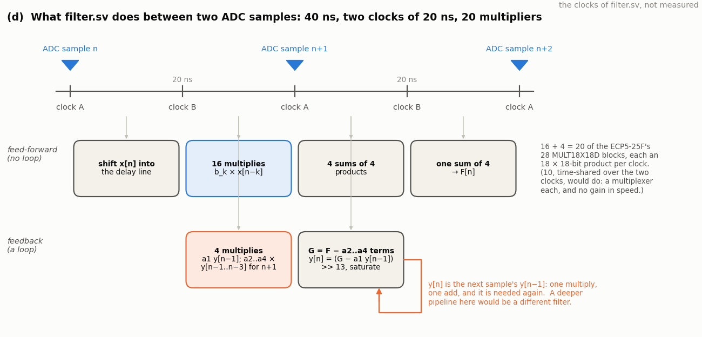

<!-- nav -->
[← 7.02 IIR filters: feedback, and an RC in one line](7_02_iir_filters.md#702-iir-filters-feedback-and-an-rc-in-one-line) &emsp;&emsp;&emsp; **[Contents](../README.md#contents)** &emsp;&emsp;&emsp; [7.04 The filter as a LiteX peripheral →](7_04_the_filter_as_a_litex_peripheral.md#704-the-filter-as-a-litex-peripheral)

# 7.03 A filter you can load


[7.01](7_01_fir_filters.md#701-fir-filters-the-sliding-dot-product) and
[7.02](7_02_iir_filters.md#702-iir-filters-feedback-and-an-rc-in-one-line)
baked their taps into the bitstream, so a new filter was a new build.
`filter.sv` keeps the arithmetic in gateware and moves the *numbers* to
the laptop: sixteen feed-forward taps and four feedback taps, loaded over
the [UART](https://en.wikipedia.org/wiki/Universal_asynchronous_receiver-transmitter), designed by scipy in the line before. It also carries its own
test signals, so that a filter can be measured by any of
[7.00](7_00_signal_processing_in_gateware.md#700-signal-processing-in-gateware)'s
three ways, and this page measures it by the first.

## The design

Direct form I, as the lower diagram of
[7.01](7_01_fir_filters.md#701-fir-filters-the-sliding-dot-product) drew it:

  *y*[*n*] = ( Σ<sub>*k*=0..15</sub> *b*<sub>*k*</sub> *x*[*n* − *k*] − Σ<sub>*k*=1..4</sub> *a*<sub>*k*</sub> *y*[*n* − *k*] ) / 8192,

with every coefficient a signed 16-bit integer in *Q2.13*: the number
times 8192, so |*c*| < 4 and the resolution is 1/8192, −78 dB. Twenty
multiplies per sample, and the ECP5 has 28 hardware multipliers, so the
design simply uses twenty of them in parallel (time-sharing ten over the
two clocks would need a multiplexer each and buy nothing). The output
state is kept in 18 bits with 8 below the ADC's step and saturates at
±512 codes, the lessons of [7.02](7_02_iir_filters.md#702-iir-filters-feedback-and-an-rc-in-one-line).



The two clocks between samples are spent as the figure shows: the
feed-forward half is pipelined (shift the delay line, sixteen products,
four sums of four, one sum of four) and does not care how deep it is; the
feedback half must close in one sample, so *a*<sub>1</sub> *y*[*n* − 1] is the
one multiply that waits for the previous output, and the other three
feedback terms, which depend on older outputs, are computed a sample
early and pre-summed. Three samples of latency in all, 120 ns, the same
whether the DAC plays the output or (for measuring) the input.

<details>
<summary>The whole file: <code>filter.sv</code></summary>

<!-- file: src/dsp/filter.sv -->
```systemverilog
// filter.sv -- a filter whose coefficients the laptop loads over the serial port (7.03):
// a direct-form-I IIR with 16 feed-forward taps and 4 feedback taps between the ADC
// (25 MS/s) and the DAC, with built-in test signals and 1.06's capture.  filter.py
// designs a filter with scipy, quantizes it, loads it, and measures it.
//
//   y[n] = ( b_0 x[n] + ... + b_15 x[n-15]  -  a_1 y[n-1] - ... - a_4 y[n-4] ) / 8192
//
// The coefficients are 16-bit signed integers in Q2.13: the value x 8192, so |c| < 4 and
// the resolution is 1/8192.  With a = 0 it is an FIR; a_1..a_4 make it an IIR, up to
// 4th order (a 2nd-order Butterworth, a one-pole RC, a resonator: see 7.02).
//
// Arithmetic.  20 multiplies per sample, one hardware multiplier each (the ECP5-25F has
// 28; time-sharing 10 of them over the two clocks a sample lasts would halve that at the
// cost of a multiplexer in front of each, and nothing here needs the space).  The 16
// feed-forward products are summed in two steps (4 x 4, then 4) because a 16-input adder
// is too slow for one 20 ns clock; that is free latency.  The feedback cannot be
// pipelined that way: y[n] needs y[n-1], which was ready only a sample ago, so the loop
// is kept to one multiply (clock 1) plus one add-and-saturate (clock 2); the other three
// feedback products, which need older outputs, are computed and pre-summed a sample
// early.  y is kept in 18 bits, Q10.8 (8 bits below the ADC's lsb, saturating at +-512)
// so that rounding is not fed back (7.02); the DAC gets y rounded and clipped to -128..127,
// plus 128.
//
// The protocol (1,000,000 baud, 8N1; multi-byte integers big-endian):
//   'B' k hi lo      b_k (k = 0..15) = the signed 16-bit value hi:lo
//   'A' k hi lo      a_k (k = 1..4)
//   'S' src          the filter's input: 0 = the ADC; 1 = an impulse, one sample of +64
//                    every 2^14 samples; 2 = a step, -64 / +64, toggling every 2^14
//                    samples; 3 = white noise, -32..31, from a 32-bit xorshift
//                    (modem_noise.sv); 4 = a tone, 64 sin, from a DDS
//   'F' word(4)      the tone's tuning word, f / 25e6 x 2^32
//   'O' out          what the DAC plays: 0 = the filter's output, 1 = its input, with
//                    the same delay (so the two can be compared)
//   'C'              capture 16384 ADC samples, then send them as 16384 raw bytes, as
//                    capture.sv does.  Recording starts at the stimulus period's start
//                    (the impulse, the step's rising edge), and the noise generator is
//                    re-seeded there, so the laptop knows the stimulus sample by sample.
//   Unknown bytes are ignored.  Power-up: b_0 = 8192 (1.0), everything else 0, src 0, out 0.
//
// Latency: the DAC shows the response to an ADC sample 3 samples (120 ns) later, for
// out = 0 and out = 1 alike.
//
// LEDs: led[4] = the output clipped in the last 84 ms; led[3] = capturing or sending;
//       led[2] = a built-in stimulus is selected; led[1] = the DAC plays the input;
//       led[0] blinks.
module filter (
    input  logic       clk,         // 50 MHz
    input  logic       uart_rx,     // from the laptop
    output logic       uart_tx,     // to the laptop
    output logic [7:0] dac_d = 128,
    output logic       dac_clk,
    input  logic [7:0] adc_d,
    output logic       adc_clk,
    output logic [4:0] led
);
    localparam integer NB = 16, NA = 4;             // feed-forward and feedback taps
    localparam integer N  = 16384;                  // the capture's length

    // ---- the serial port, both directions (uart.sv) -----------------------------------
    logic [7:0] rx_data, tx_data = 0;
    logic       rx_valid, tx_start = 0, tx_busy;
    uart_rx #(.CLKS_PER_BIT(50)) urx (.clk(clk), .rx(uart_rx), .data(rx_data), .valid(rx_valid));
    uart_tx #(.CLKS_PER_BIT(50)) utx (.clk(clk), .data(tx_data), .start(tx_start),
                                      .busy(tx_busy), .tx(uart_tx));

    // ---- the settings, as the laptop left them ----------------------------------------
    logic signed [15:0] b [0:NB-1];                 // 'B': Q2.13
    logic signed [15:0] a [1:NA];                   // 'A'
    initial begin
        b[0] = 16'sd8192;                           // 1.0: the filter starts as a wire
        for (int k = 1; k < NB; k++) b[k] = 0;
        for (int k = 1; k <= NA; k++) a[k] = 0;
    end
    logic [2:0]  src     = 0;                       // 'S'
    logic        out_in  = 0;                       // 'O': 1 = play the input
    logic [31:0] tone_word = 32'h0a3d_70a4;         // 'F': 1 MHz until told otherwise
    logic        cap_req = 0;                       // 'C' arrived (one clock)

    // ---- the command parser: a command byte, then its arguments in order (ddc.sv) -----
    logic [7:0]  cmd  = 0;                          // the command being filled in; 0 = none
    logic [7:0]  left = 0;                          // argument bytes still to come
    logic [7:0]  idx  = 0;                          // 'B', 'A': which coefficient
    logic [31:0] arg  = 0;                          // the argument bytes so far, newest lowest
    always_ff @(posedge clk) begin
      cap_req <= 0;
      if (rx_valid) begin
        if (cmd == 0)
            case (rx_data)
                "B": begin cmd <= "B"; left <= 3; end
                "A": begin cmd <= "A"; left <= 3; end
                "S": begin cmd <= "S"; left <= 1; end
                "O": begin cmd <= "O"; left <= 1; end
                "F": begin cmd <= "F"; left <= 4; end
                "C": cap_req <= 1;
                default: ;                          // not a command: ignored
            endcase
        else begin
            arg  <= {arg[23:0], rx_data};
            left <= left - 1;
            if (left == 1) cmd <= 0;                // that was the last argument
            case (cmd)
                "B": if (left == 3) idx <= rx_data;
                     else if (left == 1 && idx < NB) b[idx[3:0]] <= {arg[7:0], rx_data};
                "A": if (left == 3) idx <= rx_data;
                     else if (left == 1 && idx >= 1 && idx <= NA) a[idx[2:0]] <= {arg[7:0], rx_data};
                "S": src    <= (rx_data <= 4) ? rx_data[2:0] : 3'd0;
                "O": out_in <= rx_data[0];
                "F": if (left == 1) tone_word <= {arg[23:0], rx_data};
                default: ;
            endcase
        end
      end
    end

    // ---- the ADC at 25 MS/s, as in capture.sv -------------------------------------------
    logic adc_clk_r = 0, new_sample = 0;
    logic signed [8:0] x = 0;                       // the sample, -128..127
    always_ff @(posedge clk) begin
        adc_clk_r  <= ~adc_clk_r;
        new_sample <= 0;
        if (adc_clk_r == 0) begin
            x <= $signed({1'b0, adc_d}) - 9'sd128;
            new_sample <= 1;
        end
    end
    assign adc_clk = adc_clk_r;
    logic step = 0;                                 // the clock after new_sample
    always_ff @(posedge clk) step <= new_sample;

    // ---- the built-in stimuli, one value per sample -------------------------------------
    logic [14:0] cnt = 0;                           // counts samples; the period is 2^14
    logic        period_start;                      // the next sample is cnt 0
    assign period_start = (cnt[13:0] == 14'h3fff);
    logic signed [8:0] impulse, stp, noise, tone = 0;
    assign impulse = (cnt[13:0] == 0) ? 9'sd64 : 9'sd0;
    assign stp     = cnt[14] ? 9'sd64 : -9'sd64;
    // noise: one step of a 32-bit xorshift per sample; the sum of its four bytes is
    // nearly Gaussian (modem_noise.sv), scaled to -32..31
    localparam logic [31:0] SEED = 32'h2545_f491;
    logic [31:0] r = SEED, r1, r2, r3;
    assign r1 = r ^ (r << 13);
    assign r2 = r1 ^ (r1 >> 17);
    assign r3 = r2 ^ (r2 << 5);
    logic signed [10:0] gsum;
    assign gsum  = $signed({3'b0, r[7:0]}) + $signed({3'b0, r[15:8]}) + $signed({3'b0, r[23:16]})
                 + $signed({3'b0, r[31:24]}) - 11'sd510;
    assign noise = 9'(gsum >>> 4);
    // the tone: a DDS at the ADC's rate, 64 x sin
    logic signed [7:0] sin64 [0:255];
    initial for (int i = 0; i < 256; i++)
        sin64[i] = $rtoi($floor(64.0 * $sin(6.283185307179586 * i / 256) + 0.5));
    logic [31:0] phase = 0;
    logic        syncing;                           // a capture is waiting for cnt 0
    always_ff @(posedge clk)
        if (new_sample) begin
            cnt   <= cnt + 1;
            r     <= (syncing && period_start) ? SEED : r3;     // the laptop knows the sequence
            phase <= phase + tone_word;
            tone  <= sin64[phase[31:24]];
        end
    logic signed [8:0] u;                           // the filter's input, this sample
    always_comb case (src)
        3'd1:    u = impulse;
        3'd2:    u = stp;
        3'd3:    u = noise;
        3'd4:    u = tone;
        default: u = x;
    endcase

    // ---- the filter ---------------------------------------------------------------------
    // The feed-forward half, a pipeline: delay line (clock 1) -> 16 products (clock 2)
    // -> four sums of four (clock 3) -> F, the sum of all 16 (clock 4), ready two
    // samples after the input it belongs to.
    logic signed [8:0]  xd [0:NB-1];                // x[n-k]: the delay line
    logic signed [24:0] pb [0:NB-1];                // b_k x[n-k], 9 x 16 bits
    logic signed [26:0] q  [0:3];                   // sums of four products
    logic signed [28:0] F = 0;                      // the sum of all sixteen
    initial for (int k = 0; k < NB; k++) begin xd[k] = 0; pb[k] = 0; end
    initial for (int j = 0; j < 4; j++) q[j] = 0;
    always_ff @(posedge clk) begin
        if (new_sample) begin
            // ######################################################################
            // ##  KEY LINE 1: the delay line.  Each new input pushes the rest along.
            // ######################################################################
            xd[0] <= u;
            for (int k = 1; k < NB; k++) xd[k] <= xd[k-1];
            for (int j = 0; j < 4; j++) q[j] <= pb[4*j] + pb[4*j+1] + pb[4*j+2] + pb[4*j+3];
        end
        if (step) begin
            // ######################################################################
            // ##  KEY LINE 2: sixteen multiplies at once, one hardware multiplier each.
            // ######################################################################
            for (int k = 0; k < NB; k++) pb[k] <= b[k] * xd[k];
            F <= q[0] + q[1] + q[2] + q[3];
        end
    end

    // The feedback half.  yd[1..4] are y[n-1..n-4] in Q10.8.  On `step` (clock 2 of a
    // sample): a_1 y[n-1] for this sample, and a_2..a_4 times y[n-1..n-3] for the NEXT
    // sample.  On `new_sample` (clock 1 of the next): G = F - those three, and the new
    // y = (G - a_1 y[n-1]) >>> 13, saturated, into yd[1].
    localparam logic signed [17:0] YMAX = 18'sd131071, YMIN = -YMAX - 18'sd1;
    logic signed [17:0] yd [1:NA];
    logic signed [33:0] pa1 = 0, pa2 = 0, pa3 = 0, pa4 = 0;    // 16 x 18 bits
    logic signed [39:0] G = 0, acc, shifted;
    logic               clip_y;
    initial for (int k = 1; k <= NA; k++) yd[k] = 0;
    always_ff @(posedge clk)
        if (step) begin
            pa1 <= a[1] * yd[1];
            pa2 <= a[2] * yd[1];
            pa3 <= a[3] * yd[2];
            pa4 <= a[4] * yd[3];
        end
    assign acc     = G - pa1;                       // Q.21: 13 from the coefficients, 8 from y
    assign shifted = acc >>> 13;                    // Q10.8
    assign clip_y  = (shifted > YMAX) || (shifted < YMIN);
    always_ff @(posedge clk)
        if (new_sample) begin
            G <= (F <<< 8) - pa2 - pa3 - pa4;
            // ######################################################################
            // ##  KEY LINE 3: the output, which is also the next sample's y[n-1].
            // ######################################################################
            yd[1] <= (shifted > YMAX) ? YMAX : (shifted < YMIN) ? YMIN : 18'(shifted);
            for (int k = 2; k <= NA; k++) yd[k] <= yd[k-1];
        end

    // ---- the output: y rounded to codes, or the input with the same delay -----------------
    logic signed [18:0] y_round;
    logic signed [10:0] y, mon = 0;
    assign y_round = yd[1] + 19'sd128;
    assign y       = 11'(y_round >>> 8);
    always_ff @(posedge clk) begin
        if (new_sample) mon <= xd[2];               // the input that yd[1] answers to
        if (out_in) dac_d <= 8'(mon + 128);
        else        dac_d <= (y > 127) ? 8'd255 : (y < -128) ? 8'd0 : 8'(y + 128);
    end
    assign dac_clk = ~clk;

    // ---- capture: 16384 ADC samples into block RAM, then out of the UART (capture.sv) ----
    logic [7:0]  mem [0:N-1];
    logic [13:0] addr = 0;
    typedef enum logic [1:0] {IDLE, WAIT, RECORD, SEND} state_t;
    state_t state = IDLE;
    assign syncing = (state == WAIT);
    always_ff @(posedge clk) begin
        tx_start <= 0;
        case (state)
            IDLE:   if (cap_req) begin addr <= 0; state <= WAIT; end
            WAIT:   if (new_sample && period_start) state <= RECORD;    // the next sample is cnt 0
            RECORD: if (new_sample) begin
                        mem[addr] <= 8'(x + 128);   // the ADC's code, as capture.sv stores it
                        addr <= addr + 1;
                        if (addr == N - 1) state <= SEND;
                    end
            SEND:   if (!tx_busy && !tx_start) begin
                        tx_data  <= mem[addr];
                        tx_start <= 1;
                        addr     <= addr + 1;
                        if (addr == N - 1) state <= IDLE;
                    end
        endcase
    end

    // ---- LEDs -----------------------------------------------------------------------------
    logic [21:0] clip_timer = 0;                    // holds the clip LED on for 2^22 clocks
    logic [25:0] blink = 0;
    always_ff @(posedge clk) begin
        blink <= blink + 1;
        if (new_sample && (clip_y || y > 127 || y < -128)) clip_timer <= '1;
        else if (clip_timer != 0) clip_timer <= clip_timer - 1;
    end
    assign led = {clip_timer != 0, state == RECORD || state == SEND, src != 0, out_in, blink[25]};
endmodule
```

</details>

The laptop talks a byte protocol at 1 Mbaud: `B` *k* *hi* *lo* sets a
feed-forward tap, `A` *k* *hi* *lo* a feedback one, `S` picks the input (the
ADC, a one-sample impulse every 2<sup>14</sup> samples, a step, white noise
from a shift register, or a tone from a tuning word set with `F`), `O`
picks what the DAC plays (the filter's output, or its input delayed the
same three samples), and `C` records 16384 ADC samples, aligned to the
stimulus, in [1.06](1_06_fast_capture.md#106-fast-captures)'s format. At
power-up *b*<sub>0</sub> = 1 and everything else is 0: a wire.

## Designing, in scipy

<details>
<summary>The whole file: <code>filter.py</code></summary>

<!-- file: src/dsp/filter.py -->
```python
#!/usr/bin/env python3
"""The laptop side of filter.sv (7.03): design a filter with scipy, quantize it to the
board's 16-bit Q2.13 integers, load it over the serial port, and measure it.

Designs (one of):
    --lowpass FC [--taps N]     a windowed-sinc FIR (scipy.signal.firwin), N <= 16, default 15
    --highpass FC [--taps N]    likewise (N must be odd)
    --bandpass F1 F2 [--taps N]
    --moving N                  an N-sample moving average, N <= 16
    --edge                      [-1, 2, -1]: the second difference
    --rc FC                     the one-pole: an RC low-pass at FC (one pole at exp(-2 pi FC / fs))
    --butter ORDER FC [--high]  a Butterworth IIR, order <= 4 (scipy.signal.butter)
    --b 1,2,1 --a 1,-0.5        raw coefficients: b_0.. (16 at most), a_0.. (5 at most; divided by a_0)

Then, any of:
    (nothing)                   print the coefficient table and the predicted response, load it,
                                and leave the filter running on the ADC
    --m2k                       the M2k bench (W1 -> ADC IN, DAC OUT -> scope 1): a sine at each
                                of 40 frequencies, 100 kHz to 12 MHz; |H| is the DAC's amplitude
                                with the filter over its amplitude with 'O' 1 (the input played
                                straight through, same delay), each from a sine fit; with --ch2
                                (W1 also on scope 2+) the phase as well
    --m2k --impulse             the impulse response on the M2k's scope: the board's own one-
                                sample impulse (src 1), through the filter, out of the DAC
    --measure impulse|step|noise   ONE BOARD LOOPED BACK (DAC OUT -> ADC IN): a built-in stimulus
                                goes through the filter, out of the DAC, through the cable and
                                into the ADC, so the capture IS the response (untested until the
                                cable is back; written against channel.py's cable model)
    --src N --out N --tone F    the stimulus (0 ADC, 1 impulse, 2 step, 3 noise, 4 tone), what the
                                DAC plays (0 output, 1 input), and the tone's frequency, by hand
    --capture                   16384 ADC samples at 25 MS/s, as capture.py
    --design-only               no board: the table and the prediction only
    --selftest                  the Python model of filter.sv against filter_tb.sv's numbers
    -o NAME.npz                 save what was measured;  --no-plot
    PORT, or --port PORT        the serial port (default: find the Icepi Zero)

    python3 filter.py /dev/ttyUSB0 --lowpass 2e6 --m2k -o ../../dev/data/dsp_lowpass.npz
    python3 filter.py --moving 16 --m2k --impulse -o ../../dev/data/dsp_impulse.npz
    python3 filter.py --rc 1e6 --measure step        # with the loopback cable

The board's arithmetic (filter.sv): y[n] = (sum b_k x[n-k] - sum a_k y[n-k]) / 8192 with the
coefficients as integers, y kept with 8 bits below the ADC's lsb and saturating at +-512, and
the DAC playing y rounded and clipped to -128..127, plus 128.  simulate() below is that,
bit for bit; it is what the testbench checked, and what the predictions here are made with.
"""
import argparse
import os
import struct
import sys
import time

import numpy as np

HERE = os.path.dirname(os.path.abspath(__file__))
sys.path.insert(0, os.path.join(HERE, "..", "..", "dev", "tools"))      # m2k.py (the instructor's bench)

FS = 25e6                       # the ADC's rate: the filter runs once per sample
SCALE = 8192                    # Q2.13: the coefficient x 8192 is the integer the board holds
NB, NA = 16, 4                  # b_0..b_15, a_1..a_4
N = 16384                       # the capture's length
IMPULSE, STEP, NOISE = 64, 64, 32   # the built-in stimuli, in ADC codes
SEED = 0x2545F491               # the noise generator's seed at each capture
CABLE_GAIN = 0.776              # ADC codes per DAC code through the loopback cable (1.07)
DAC_V = 0.0307                  # volts per DAC code (0.00)
SRC_NAMES = ["ADC", "impulse", "step", "noise", "tone"]


# ---- the port -----------------------------------------------------------------------
def find_port():
    """The first FTDI FT231X serial port (USB ID 0403:6015): the Icepi Zero's."""
    from serial.tools import list_ports
    for p in list_ports.comports():
        if (p.vid, p.pid) == (0x0403, 0x6015):
            return p.device
    raise SystemExit("No Icepi Zero found. Is it plugged in? (Or give --port.)")


def open_port(port=None, baud=1_000_000):
    import serial                                   # pip install pyserial
    ser = serial.Serial(port or find_port(), baud, timeout=3)
    time.sleep(0.02)
    ser.reset_input_buffer()                        # the FT231X's junk byte on opening
    return ser


class Board:
    """filter.sv's commands (see the header of filter.sv)."""

    def __init__(self, port=None):
        self.ser = open_port(port)

    def coef(self, which, k, v):
        self.ser.write(which + bytes([k]) + struct.pack(">h", int(v)))

    def upload(self, bq, aq):
        """All 16 b's and 4 a's, as 16-bit integers (the unused ones 0)."""
        for k in range(NB):
            self.coef(b"B", k, bq[k] if k < len(bq) else 0)
        for k in range(1, NA + 1):
            self.coef(b"A", k, aq[k] if k < len(aq) else 0)

    def set_src(self, s):
        self.ser.write(b"S" + bytes([int(s)]))

    def set_out(self, o):
        self.ser.write(b"O" + bytes([int(o)]))

    def set_tone(self, f_hz):
        self.ser.write(b"F" + struct.pack(">I", int(round(f_hz / FS * 2**32)) & 0xFFFFFFFF))

    def capture(self):
        """16384 ADC codes (0..255), recorded from the stimulus period's start."""
        self.ser.reset_input_buffer()
        self.ser.write(b"C")
        raw = self.ser.read(N)
        if len(raw) != N:
            raise RuntimeError("got %d of %d bytes -- is filter.bit loaded?" % (len(raw), N))
        return np.frombuffer(raw, dtype=np.uint8).astype(int)


# ---- the designs --------------------------------------------------------------------
def design(args):
    """(b, a, name) as floats, a[0] = 1, from the command line."""
    from scipy import signal
    n = args.taps
    if args.lowpass is not None:
        return signal.firwin(n, args.lowpass, fs=FS), [1.0], "low-pass %s, %d taps" % (hz(args.lowpass), n)
    if args.highpass is not None:
        n = min(n, NB - 1) | 1                      # a high-pass needs an odd number of taps
        return signal.firwin(n, args.highpass, pass_zero=False, fs=FS), [1.0], "high-pass %s, %d taps" % (hz(args.highpass), n)
    if args.bandpass is not None:
        f1, f2 = args.bandpass
        return signal.firwin(n, [f1, f2], pass_zero=False, fs=FS), [1.0], "band-pass %s-%s, %d taps" % (hz(f1), hz(f2), n)
    if args.moving is not None:
        return np.ones(args.moving) / args.moving, [1.0], "%d-sample moving average" % args.moving
    if args.edge:
        return np.array([-1.0, 2.0, -1.0]), [1.0], "edge detector [-1 2 -1]"
    if args.rc is not None:
        p = np.exp(-2 * np.pi * args.rc / FS)       # the pole: an RC's impulse response, sampled
        return np.array([1 - p]), np.array([1.0, -p]), "one-pole RC at %s" % hz(args.rc)
    if args.butter is not None:
        order, fc = int(args.butter[0]), args.butter[1]
        b, a = signal.butter(order, fc, btype="high" if args.high else "low", fs=FS)
        return b, a, "Butterworth %s-pass, order %d, %s" % ("high" if args.high else "low", order, hz(fc))
    if args.b is not None:
        b = np.array([float(v) for v in args.b.split(",")])
        a = np.array([float(v) for v in args.a.split(",")]) if args.a else np.array([1.0])
        return b / a[0], a / a[0], "b = %s, a = %s" % (args.b, args.a or "1")
    return np.array([1.0]), [1.0], "a wire (b_0 = 1)"


def hz(f):
    return "%g MHz" % (f / 1e6) if f >= 1e6 else "%g kHz" % (f / 1e3)


def quantize(c):
    """Coefficients -> the board's integers (x 8192, rounded, clipped to 16 bits)."""
    q = np.round(np.asarray(c, float) * SCALE).astype(int)
    return np.clip(q, -32768, 32767)


def poles(aq):
    """The quantized denominator's roots: |pole| < 1 is stable."""
    a = np.concatenate([[SCALE], np.asarray(aq[1:], float)]) / SCALE
    return np.roots(a) if len(a) > 1 else np.array([])


def response(bq, aq, f):
    """The quantized filter's H(f), complex, from scipy.signal.freqz."""
    from scipy import signal
    a = np.concatenate([[SCALE], np.asarray(aq[1:], float)]) / SCALE
    _, H = signal.freqz(np.asarray(bq, float) / SCALE, a, worN=np.atleast_1d(f), fs=FS)
    return H


def table(b, a, bq, aq, name):
    """Print the coefficients, their integers, and the predicted response."""
    print("design: %s" % name)
    print("  k        b_k    int     hex   |      a_k    int     hex")
    for k in range(max(len(b), len(a))):
        left = "%2d  %9.5f  %6d  0x%04x" % (k, b[k], bq[k], bq[k] & 0xFFFF) if k < len(b) else " " * 31
        right = "%9.5f  %6d  0x%04x" % (a[k], aq[k], aq[k] & 0xFFFF) if 1 <= k < len(a) else ""
        print("%s   | %s" % (left, right))
    big = [c for c in np.concatenate([b, a[1:]]) if abs(c) >= 4]
    if big:
        print("  WARNING: |coefficient| >= 4 does not fit Q2.13; clipped to +-3.9999: %s" % big)
    p = poles(aq)
    if len(p):
        r = np.abs(p).max()
        print("  poles after quantization: |p| max = %.5f %s" % (r, "UNSTABLE" if r >= 1 else "(stable)"))
        if r >= 1:
            print("  WARNING: the quantized denominator is unstable; lower the order or raise the cutoff")
    from scipy import signal
    fs_ = [0.25e6, 0.5e6, 1e6, 2e6, 3e6, 4e6, 5e6, 6e6, 8e6, 10e6, 12e6]
    _, Hd = signal.freqz(b, a, worN=fs_, fs=FS)
    Hq = response(bq, aq, fs_)
    print("  predicted |H|, dB:  " + "  ".join("%6s" % hz(f).replace(" MHz", "M").replace(" kHz", "k") for f in fs_))
    print("    as designed:      " + "  ".join("%6.1f" % db(v) for v in Hd))
    print("    as quantized:     " + "  ".join("%6.1f" % db(v) for v in Hq))


def db(v):
    return 20 * np.log10(np.abs(v) + 1e-12)


# ---- the model of filter.sv, bit for bit ---------------------------------------------
def simulate(bq, aq, x):
    """What the DAC plays (y, -128..127) for ADC-code input x (ints), aligned with x; the
    hardware shows it 3 samples later.  Integer arithmetic exactly as filter.sv's."""
    bq = np.asarray(bq, np.int64)
    aq = [int(v) for v in np.asarray(aq)[:NA + 1]] + [0] * (NA + 1 - len(aq))
    x = np.asarray(x, np.int64)
    F = np.convolve(x, bq)[:len(x)] << 8            # the feed-forward sums, in Q.21
    y = np.empty(len(x), np.int64)
    w = [0] * (NA + 1)                               # w[k] = y[n-k] in Q10.8
    for n in range(len(x)):
        acc = int(F[n]) - sum(aq[k] * w[k] for k in range(1, NA + 1))
        s = max(-131072, min(131071, acc >> 13))     # saturate to 18 bits
        w = [0, s] + w[1:NA]
        y[n] = max(-128, min(127, (s + 128) >> 8))   # rounded, clipped, as the DAC shows it
    return y


def noise_sequence(n, seed=SEED):
    """The board's noise stimulus from a capture's start: a 32-bit xorshift, the four bytes
    of each state added, -510, >> 4: -32..31, nearly Gaussian, 9 codes rms."""
    r, out = seed, np.empty(n, int)
    for i in range(n):
        s = (r & 0xFF) + ((r >> 8) & 0xFF) + ((r >> 16) & 0xFF) + ((r >> 24) & 0xFF) - 510
        out[i] = s >> 4
        r ^= (r << 13) & 0xFFFFFFFF
        r ^= r >> 17
        r ^= (r << 5) & 0xFFFFFFFF
    return out


def stimulus(src, n=N):
    """The built-in stimulus as the filter sees it from a capture's start."""
    k = np.arange(n)
    if src == 1:
        return np.where(k % 2**14 == 0, IMPULSE, 0)
    if src == 2:
        return np.where((k // 2**14) % 2 == 0, STEP, -STEP)     # +64 first: the capture starts at the rising edge
    if src == 3:
        return noise_sequence(n)
    raise ValueError("src 1, 2 or 3")


def selftest():
    """simulate() against the numbers filter_tb.sv printed for filter.sv."""
    taps = np.array([3, -5, 7, 11, -2]) * 128
    x = np.zeros(20, int); x[5] = IMPULSE
    y = simulate(taps, [SCALE], x)
    ok1 = list(y[5:10]) == [3, -5, 7, 11, -2] and not y[:5].any() and not y[10:].any()
    print("impulse through [3 -5 7 11 -2] x 128:", list(y[5:10]), "ok" if ok1 else "FAIL")
    x = np.concatenate([np.full(16384, -64), np.full(60, 64)])
    y = simulate([819], [SCALE, -7373], x)[16384:]
    want = {0: -51, 1: -40, 2: -29, 3: -20, 4: -12, 5: -4, 6: 3, 7: 9, 12: 31, 20: 50, 28: 58, 36: 61, 44: 63, 52: 64}
    ok2 = all(y[k] == v for k, v in want.items())
    print("step through the one-pole a1 = -0.9, b0 = 0.1:", list(y[:8]), "...", "ok" if ok2 else "FAIL")
    y = simulate([32767], [SCALE], np.array([64, -64]))
    ok3 = list(y) == [127, -128]
    print("b0 = 3.9999, +-64: ", list(y), "ok (saturates)" if ok3 else "FAIL")
    nz = noise_sequence(1000)
    ok4 = nz.min() >= -32 and nz.max() <= 31 and 8 < nz.std() < 10.5
    print("noise: %d..%d, %.1f codes rms" % (nz.min(), nz.max(), nz.std()), "ok" if ok4 else "FAIL")
    print("PASS" if ok1 and ok2 and ok3 and ok4 else "FAIL")
    return ok1 and ok2 and ok3 and ok4


# ---- the M2k bench: W1 -> ADC IN, DAC OUT -> scope 1 ---------------------------------
class Scope:
    """The ADALM2000 through dev/tools/m2k.py: a sine on W1, captures on channel 1 (and 2)."""

    def __init__(self):
        import m2k
        self.m2k = m2k
        self.m = m2k.M2k()
        self.m.ctx.setTimeout(3000)                 # ms: a capture that never triggers raises

    def sine(self, f, amp):
        """A sine of amplitude amp (V) on W1; returns the frequency actually made."""
        fa = self.m.w1_sine(f, amp)
        time.sleep(0.15)                            # the AWG restarts
        return fa

    def grab(self, n=N, rate=1e8, high=True, trigger=None, pre=0):
        """n samples of channel 1 (and 2) at `rate`; high = the +-2.5 V range.
        trigger = (level in V, rising) on channel 1, with `pre` samples before it."""
        import libm2k
        m, ain, trig = self.m, self.m.ain, self.m.trig
        m.set_range(0, high)
        m.set_range(1, high)
        ain.setSampleRate(rate)
        ain.setOversamplingRatio(1)
        if trigger is None:
            trig.setAnalogMode(0, libm2k.ALWAYS)
        else:
            level, rising = trigger
            trig.setAnalogSource(0)
            trig.setAnalogMode(0, libm2k.ANALOG)
            trig.setAnalogCondition(0, libm2k.RISING_EDGE_ANALOG if rising else libm2k.FALLING_EDGE_ANALOG)
            trig.setAnalogLevel(0, float(level))
            trig.setAnalogDelay(-int(pre))
        trig.setAnalogStreamingFlag(False)
        ain.stopAcquisition()
        data = np.array(ain.getSamples(n))
        return np.arange(n) / rate, data[0], data[1]

    def fit(self, t, v, f):
        return self.m2k.fit_sine(t, v, f)           # f, A, phi, offset, rms

    def close(self):
        self.m.close()


def sweep(board, scope, bq, aq, freqs, amp=1.0, ch2=False, verbose=True):
    """|H| (and the phase, with ch2) at each frequency: the DAC's sine with the filter over
    the DAC's sine with the input played straight through."""
    out = dict(f=[], A_in=[], A_out=[], H=[], phase=[], rms_in=[], rms_out=[])
    if verbose:
        print("  %9s  %8s  %8s  %8s  %8s  %7s" % ("MHz", "in (V)", "out (V)", "|H| dB", "predict", "phase"))
    for f in freqs:
        fa = scope.sine(f, amp)
        Hp = response(bq, aq, fa)[0]
        board.set_out(1)
        time.sleep(0.02)
        t, v1, v2 = scope.grab(high=True)
        _, A_in, ph_in, _, rms_in = scope.fit(t, v1, fa)
        ph_ref_in = scope.fit(t, v2, fa)[2] if ch2 else 0.0
        board.set_out(0)
        time.sleep(0.02)
        high = A_in * abs(Hp) * 1.4 < 2.4           # the +-2.5 V range unless the output is big
        t, v1, v2 = scope.grab(high=high)
        _, A_out, ph_out, _, rms_out = scope.fit(t, v1, fa)
        if high and A_out > 2.3:                    # clipped after all: the +-25 V range
            t, v1, v2 = scope.grab(high=False)
            _, A_out, ph_out, _, rms_out = scope.fit(t, v1, fa)
        ph_ref_out = scope.fit(t, v2, fa)[2] if ch2 else 0.0
        H = A_out / A_in
        phase = ((ph_out - ph_ref_out) - (ph_in - ph_ref_in) + np.pi) % (2 * np.pi) - np.pi if ch2 else np.nan
        for k, v in zip(out, (fa, A_in, A_out, H, phase, rms_in, rms_out)):
            out[k].append(v)
        if verbose:
            print("  %9.4f  %8.4f  %8.4f  %8.2f  %8.2f  %7s" % (fa / 1e6, A_in, A_out, db(H), db(Hp),
                                                              "" if ch2 is False else "%+.1f" % np.degrees(phase)))
    board.set_out(0)
    return {k: np.array(v) for k, v in out.items()}


def impulse_trace(board, scope, bq, aq, n=1500, pre=100, rate=1e8):
    """The filter's impulse response as the scope sees it: src 1 (one sample of +64 every
    2^14 samples) through the filter to the DAC; triggered on its first big sample."""
    h = simulate(bq, aq, stimulus(1, 256))          # the DAC codes the impulse should give
    k = int(np.argmax(np.abs(h) >= 0.5 * np.abs(h).max()))
    level, rising = 0.5 * h[k] * DAC_V, h[k] > 0
    board.set_src(1)
    board.set_out(0)
    time.sleep(0.02)
    t, v, _ = scope.grab(n, rate, high=np.abs(h).max() * DAC_V < 2.2, trigger=(level, rising), pre=pre)
    board.set_src(0)
    return t, v, h


# ---- one board looped back: DAC OUT -> ADC IN -----------------------------------------
def loopback(board, kind, bq, aq, ntaps=64):
    """The impulse response from a capture of the stimulus `kind` (impulse, step or noise)
    through the filter, the DAC, the cable and the ADC.  Returns (h, f, H, record, delay).
    UNTESTED on hardware (written against the cable model of 1.07: 0.776 codes per code,
    about 6 samples of delay)."""
    src = ["", "impulse", "step", "noise"].index(kind)
    board.set_src(src)
    board.set_out(0)
    time.sleep(0.01)
    rec = board.capture() - 128.0
    board.set_src(0)
    u = stimulus(src).astype(float)
    if kind == "impulse":
        x = rec - np.median(rec)                    # the cable's DC offset
        h_full = x / (IMPULSE * CABLE_GAIN)
    elif kind == "step":
        h_full = np.diff(rec, prepend=rec[0]) / (2 * STEP * CABLE_GAIN)
    else:                                           # least squares: rec[n] = sum_k h[k] u[n-d-k]
        c = np.fft.irfft(np.fft.rfft(rec - rec.mean()) * np.conj(np.fft.rfft(u - u.mean())))
        d = int(np.argmax(c[:64]))
        rows = np.arange(200, N)
        X = np.stack([u[rows - d - k] for k in range(ntaps)], axis=1)
        h, *_ = np.linalg.lstsq(X, rec[rows] - rec.mean(), rcond=None)
        h_full = np.zeros(N)
        h_full[d:d + ntaps] = h / CABLE_GAIN
    hp = simulate(bq, aq, stimulus(1, 256)) / IMPULSE          # the prediction, per unit impulse
    c = np.correlate(h_full[:512], hp, "full")                 # where the response starts
    d = int(np.argmax(c)) - len(hp) + 1
    h = h_full[max(d, 0):max(d, 0) + ntaps]
    f = np.fft.rfftfreq(N, 1 / FS)
    H = np.fft.rfft(np.roll(h_full, -max(d, 0)))
    return h, f, H, rec, d


# ---- main -----------------------------------------------------------------------------
def main():
    ap = argparse.ArgumentParser(description=__doc__, formatter_class=argparse.RawDescriptionHelpFormatter)
    ap.add_argument("port_arg", nargs="?", metavar="PORT", help="serial port (default: find the Icepi Zero)")
    g = ap.add_argument_group("design")
    g.add_argument("--lowpass", type=float, metavar="FC")
    g.add_argument("--highpass", type=float, metavar="FC")
    g.add_argument("--bandpass", type=float, nargs=2, metavar=("F1", "F2"))
    g.add_argument("--taps", type=int, default=15)
    g.add_argument("--moving", type=int, metavar="N")
    g.add_argument("--edge", action="store_true")
    g.add_argument("--rc", type=float, metavar="FC")
    g.add_argument("--butter", type=float, nargs=2, metavar=("ORDER", "FC"))
    g.add_argument("--high", action="store_true", help="--butter: a high-pass")
    g.add_argument("--b", help="raw b's, comma-separated")
    g.add_argument("--a", help="raw a's, comma-separated (a_0 first)")
    g = ap.add_argument_group("measure")
    g.add_argument("--m2k", action="store_true")
    g.add_argument("--impulse", action="store_true", help="--m2k: the impulse response on the scope")
    g.add_argument("--ch2", action="store_true", help="--m2k: W1 is also on scope 2: measure the phase")
    g.add_argument("--amp", type=float, default=1.0, help="--m2k: W1's amplitude, V (default 1)")
    g.add_argument("--points", type=int, default=40)
    g.add_argument("--fmin", type=float, default=100e3)
    g.add_argument("--fmax", type=float, default=12e6)
    g.add_argument("--measure", choices=["impulse", "step", "noise"], help="looped back: see above")
    g.add_argument("--src", type=int)
    g.add_argument("--out", type=int)
    g.add_argument("--tone", type=float)
    g.add_argument("--capture", action="store_true")
    g.add_argument("--design-only", action="store_true")
    g.add_argument("--selftest", action="store_true")
    g.add_argument("--port")
    g.add_argument("-o", "--save", metavar="NAME.npz")
    g.add_argument("--no-plot", action="store_true")
    args = ap.parse_args()
    args.port = args.port or args.port_arg
    if args.selftest:
        sys.exit(0 if selftest() else 1)

    b, a, name = design(args)
    if len(b) > NB or len(a) > NA + 1:
        sys.exit("too many taps: %d b's (max %d), %d a's (max %d)" % (len(b), NB, len(a), NA + 1))
    bq, aq = quantize(b), quantize(a)
    table(b, a, bq, aq, name)
    saved = dict(name=name, b=bq, a=aq, bf=b, af=a, fs=FS)
    if args.design_only:
        if args.save:
            np.savez(args.save, **saved)
        return

    board = Board(args.port)
    board.upload(bq, aq)
    print("loaded")
    if args.src is not None:
        board.set_src(args.src)
    if args.out is not None:
        board.set_out(args.out)
    if args.tone is not None:
        board.set_tone(args.tone)

    if args.capture:
        rec = board.capture()
        print("%d samples at 25 MS/s; codes %d..%d, mean %.1f" % (N, rec.min(), rec.max(), rec.mean()))
        saved.update(rec=rec, source="ADC capture")

    if args.m2k:
        scope = Scope()
        try:
            if args.impulse:
                t, v, h = impulse_trace(board, scope, bq, aq)
                print("impulse: the scope saw %.3f to %.3f V; predicted peak %.3f V" % (v.min(), v.max(), np.abs(h).max() * DAC_V))
                saved.update(t=t, v=v, h_codes=h, source="measured, M2k scope on DAC OUT, the board's impulse")
            else:
                freqs = np.geomspace(args.fmin, args.fmax, args.points)
                r = sweep(board, scope, bq, aq, freqs, args.amp, args.ch2)
                Hp = response(bq, aq, r["f"])
                err = db(r["H"]) - db(Hp)
                sel = db(Hp) > -40
                print("measured - predicted |H|: %.2f dB rms where the prediction is above -40 dB" % np.sqrt(np.mean(err[sel]**2)))
                saved.update(r, H_pred=Hp, amp=args.amp, source="measured, M2k: W1 -> ADC IN, DAC OUT -> scope 1" + (" and 2" if args.ch2 else ""))
        finally:
            scope.close()

    if args.measure:
        h, f, H, rec, d = loopback(board, args.measure, bq, aq)
        hp = simulate(bq, aq, stimulus(1, 256)) / IMPULSE
        print("loopback %s: the response begins %d samples into the capture; measured taps / predicted:" % (args.measure, d))
        for k in range(min(8, len(h))):
            print("  h[%d] = %+.4f  (%+.4f)" % (k, h[k], hp[k]))
        saved.update(h=h, h_pred=hp[:len(h)], f_lb=f, H_lb=H, rec=rec, delay=d,
                     source="measured, one board looped back, %s" % args.measure)

    if args.save:
        np.savez(args.save, **saved)
        print("saved", args.save)
    if args.no_plot or not ({"f", "t", "h", "rec"} & set(saved)):
        return
    import matplotlib.pyplot as plt
    if "f" in saved:
        fig, ax = plt.subplots(2 if args.ch2 else 1, 1, figsize=(8, 6), squeeze=False)
        ff = np.geomspace(args.fmin, args.fmax, 400)
        ax[0, 0].semilogx(ff / 1e6, db(response(bq, aq, ff)), color="C1", label="predicted (quantized)")
        ax[0, 0].semilogx(saved["f"] / 1e6, db(saved["H"]), "o", color="C0", ms=4, label="measured")
        ax[0, 0].set_ylabel("|H| (dB)"); ax[0, 0].set_ylim(-70, 15); ax[0, 0].grid(True, which="both")
        ax[0, 0].legend(); ax[0, 0].set_title(name)
        if args.ch2:
            ax[1, 0].semilogx(ff / 1e6, np.degrees(np.angle(response(bq, aq, ff))), color="C1")
            ax[1, 0].semilogx(saved["f"] / 1e6, np.degrees(saved["phase"]), "o", color="C0", ms=4)
            ax[1, 0].set_ylabel("phase (deg)"); ax[1, 0].grid(True, which="both")
        ax[-1, 0].set_xlabel("frequency (MHz)")
    elif "t" in saved:
        plt.plot(saved["t"] * 1e6, saved["v"], color="C0", lw=1)
        plt.xlabel("time (µs)"); plt.ylabel("DAC OUT (V)"); plt.grid(True)
        plt.title("impulse response: %s" % name)
    elif "h" in saved:
        plt.stem(saved["h"], linefmt="C0-", markerfmt="C0o", basefmt=" ", label="measured")
        plt.plot(saved["h_pred"], "C1x", label="predicted")
        plt.xlabel("sample"); plt.ylabel("impulse response"); plt.legend(); plt.grid(True)
    else:
        plt.plot(np.arange(N) / FS * 1e6, saved["rec"], lw=0.5)
        plt.xlabel("time (µs)"); plt.ylabel("ADC code"); plt.grid(True)
    plt.tight_layout()
    plt.show()


if __name__ == "__main__":
    main()
```

</details>

```console
$ cd src/dsp
$ make load-filter
$ python3 filter.py --lowpass 2e6 --design-only
design: low-pass 2 MHz, 15 taps
  k        b_k    int     hex   |      a_k    int     hex
 0   -0.00150     -12  0xfff4   |
 1    0.00094       8  0x0008   |
 2    0.01062      87  0x0057   |
 3    0.03533     289  0x0121   |
 4    0.07626     625  0x0271   |
 5    0.12457    1020  0x03fc   |
 6    0.16409    1344  0x0540   |
 7    0.17938    1470  0x05be   |
 8    0.16409    1344  0x0540   |
 9    0.12457    1020  0x03fc   |
10    0.07626     625  0x0271   |
11    0.03533     289  0x0121   |
12    0.01062      87  0x0057   |
13    0.00094       8  0x0008   |
14   -0.00150     -12  0xfff4   |
  predicted |H|, dB:    250k    500k      1M      2M      3M      4M      5M      6M      8M     10M     12M
    as designed:        -0.1    -0.3    -1.2    -5.0   -12.1   -24.6   -54.2   -58.3   -68.1   -68.7   -57.8
    as quantized:       -0.1    -0.3    -1.2    -5.0   -12.1   -24.6   -54.2   -57.9   -81.7   -72.5   -58.6
```

`filter.py` has a flag for each of the classic designs: `--lowpass`,
`--highpass`, `--bandpass` (windowed sincs from `firwin`), `--moving`,
`--edge`, `--rc` (the one-pole with its cutoff in hertz), `--butter ORDER
FC` (an IIR from `scipy.signal.butter`) and raw `--b`/`--a` lists. Each
prints the design, its quantized integers, and the response "as designed"
and "as quantized" at eleven frequencies: the two agree to 0.1 dB in
every passband and part company only deep in the stopband, where
−78 dB of coefficient resolution is what you get. Try `--butter 4 200e3`
and it will tell you that *a*<sub>2</sub> = 5.6 does not fit in Q2.13 and the
quantized filter would be unstable: [7.02](7_02_iir_filters.md#702-iir-filters-feedback-and-an-rc-in-one-line)'s
third lesson, in a warning.

## Measuring, three ways

**With a function generator and a scope** (`--m2k`): the ADALM2000's W1
plays a sine at each of forty frequencies into ADC IN and its scope reads
DAC OUT, and |*H*| is the ratio of the DAC's amplitude with the filter to
its amplitude with the input played straight through (`O` 1). That ratio
cancels everything that is not the filter: the ADC's 25.4 codes per volt,
the DAC's 30.7 mV per code, the DAC's own zero-order-hold droop (−3.6 dB
at 12 MHz) and the generator's response. Frequencies above 12.5 MHz
alias, so the sweep stops at 12:

```console
$ python3 filter.py --moving 16 --m2k -o ../../dev/data/dsp_moving.npz
...
        MHz    in (V)   out (V)    |H| dB   predict
     0.1000    0.7838    0.7829     -0.01     -0.01
     0.4363    0.7760    0.6791     -1.16     -1.14
     1.0302    0.7556    0.3225     -7.40     -7.44
     1.4889    0.7415    0.0370    -26.04    -26.10
     1.6834    0.7359    0.0517    -23.07    -22.89
     3.1097    0.7011    0.0001    -78.81    -45.96
     5.0818    0.6850    0.0484    -23.02    -22.53
    12.0003    0.4888    0.0269    -25.19    -25.54
measured - predicted |H|: 0.25 dB rms where the prediction is above -40 dB
```

The moving average's first null lands at 1.49 MHz, where 25 MHz/16 says
1.56 and the quantized design says 1.49; the −79 dB at 3.1 MHz is the
measurement's floor (the ADC's eight bits put it near −60 dB, and a null
reads whatever noise is left). The four filters in the figure came out
0.25, 0.91, 0.12 and 0.06 dB rms from their designs. The oscilloscope
panel is `--m2k --impulse`: the board's own one-sample impulse into the
moving average, and the sixteen taps come out as a 640 ns pulse of
64 × 30.7 mV/16, held 40 ns per tap, which is the [impulse response](https://en.wikipedia.org/wiki/Impulse_response) seen
rather than inferred.

**With a second board** as the [network analyzer](https://en.wikipedia.org/wiki/Network_analyzer_(electrical)): untested here, see
[7.00](7_00_signal_processing_in_gateware.md#700-signal-processing-in-gateware).

**With one board, looped back** (`--measure impulse|step|noise`): the
stimulus is made inside the FPGA, the DAC plays the filter's output, the
cable returns it, and `C` records it aligned to the stimulus; an impulse
gives the taps directly, a step the integral, and noise the response by
deconvolution against the shift register's known sequence. Written and
checked against the cable model; on the board, with the cable back, the
impulse mode returns the low-pass's taps to the ADC's one-code resolution
but one tap late, and the step and noise modes return nothing: its
alignment code is wrong, and it is the first "Try this". The sweeps above
are the measurements this chapter stands on.

## What it costs

| | `filter.sv` |
| --- | ---: |
| multipliers | 20 of 28 |
| block RAM | 8 (the capture buffer) |
| logic | about 1700 cells, 7% |
| clock | 99 MHz, passes at 50 |
| latency | 3 samples, 120 ns |

Twenty of twenty-eight multipliers for one filter at the full sample
rate: that is the budget line every FPGA signal chain is drawn against,
and the reason [7.04](7_04_the_filter_as_a_litex_peripheral.md#704-the-filter-as-a-litex-peripheral)'s
SoC, which already used seven, ends up with one to spare.

**Try this:**

- `--bandpass 3e6 5e6 --m2k`, then `--butter 2 1e6 --m2k`: an FIR and an
  IIR of about the same cost, and their phase (`--ch2`, with W1 also on
  the scope's second channel).
- `--b 0.0625 --a 1,-0.9375`: that is `iir_k4` exactly. Then
  `--a 1,-0.99`: watch the dead zone and the ring.
- Design a notch at 1 MHz (`iirnotch`) and put a 1 MHz sine plus a
  300 kHz square wave into it from W1.
- Fix `--measure`: find the impulse in the capture by its peak, not by
  the stimulus counter, and the step by its edge; then `--measure impulse`
  for every design above against the sweeps.
- Load the identity (`--b 1`) and `S` 3 (noise), `O` 0: the DAC plays
  white noise; the scope's FFT is flat. Then any filter: the FFT is |*H*|
  at a glance, which is the quickest filter measurement there is.
