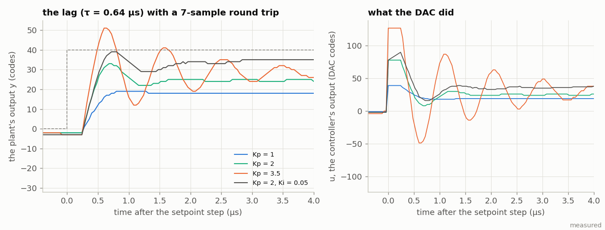
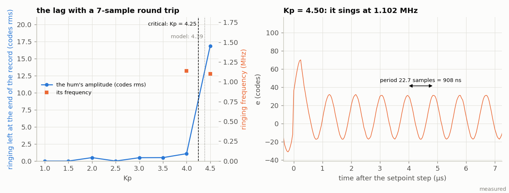
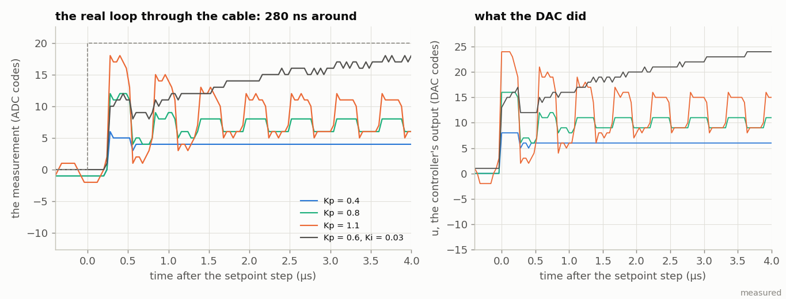
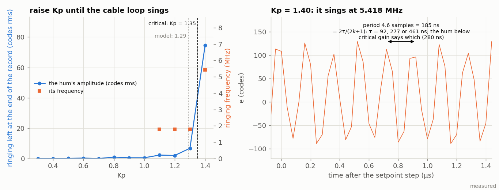

<!-- nav -->
[← 7.05 Trading speed for bits](7_05_trading_speed_for_bits.md#705-trading-speed-for-bits) &emsp;&emsp;&emsp; **[Contents](../README.md#contents)** &emsp;&emsp;&emsp; [7.07 Bigger ideas: NMR, MRI and qubits →](7_07_bigger_ideas.md#707-bigger-ideas-nmr-mri-and-qubits)

# 7.06 Control at the speed of the cable


[4.08](4_08_feedback_control.md#408-feedback-control-of-an-rc-plant) worked
out feedback control of an RC on paper and could not test it, because a
loop that goes through the laptop closes in milliseconds and an RC with a
microsecond time constant is gone by then. A controller in gateware
closes in two clocks. This page builds one, a PID at 25 million updates
a second, and uses it to measure the one number that decides how fast
any feedback loop can be: not the gain, not the processor, but the
*latency* around the loop. That number is 280 ns here, and it is what a
laser lock, an intensity noise-eater and a superconducting qubit's
readout feedback have in common with this board, which is the author's
reason for the page: control at these rates is training, or a proxy,
for the control of quantum systems and of light.

## The loop, and where the time goes

Every ADC sample, `control.sv` computes the error *e* = setpoint −
measurement, then *u* = *K*<sub>p</sub> *e* + *K*<sub>i</sub> Σ*e* + *K*<sub>d</sub> Δ*e*, and
the DAC plays 128 + *u*, saturated. The gains are 16-bit words with a
scale each (*K*<sub>p</sub> in 1/1024, *K*<sub>i</sub> per sample in 1/65536, *K*<sub>d</sub> in
1/256, as the Red Pitaya's PID does it); the integrator has anti-windup
(it holds while the DAC is pinned, and sits at zero while *K*<sub>i</sub> = 0,
which a simulation taught the hard way: without that rule the sum wound
silently to its clamp during a P-only run and dumped 3000 codes into the
DAC the moment *K*<sub>i</sub> was switched on). From the ADC's word being
registered to the DAC's word changing is **two clocks, 40 ns**. The rest
of the figure's bar is the converters: the AD9280's three-stage pipeline
delivers a sample 145 ns after it was taken and the FPGA registers it on
the next edge at 160; the AD9708 latches 10 ns later and settles in
about 35 with the cable; then the loop waits for the next sampling edge.
About 280 ns, seven samples, round the loop, of which the controller is
one seventh and the ADC's pipeline four.

<details>
<summary>The whole file: <code>control.sv</code></summary>

<!-- file: src/dsp/control.sv -->
```systemverilog
// control.sv -- a PID controller in gateware, one update per ADC sample (25 MS/s), with the
// loop closed through the real world (DAC OUT -> whatever you wire -> ADC IN) or through a
// plant simulated inside the FPGA, with the ADC as a disturbance the controller must fight.
// The laptop sets the gains, steps the setpoint, and reads back a 16384-sample record.
// Section 7.06; control.py does the laptop side, control_model.py is the same loop in Python.
//
// The controller:  e = setpoint - measurement          (in ADC codes)
//                  u = Kp e + Ki sum(e) + Kd (e - e_prev)
//                  DAC = 128 + bias + u, saturated to 0..255.
// The integrator stops integrating while the DAC is pinned at a rail and the error would
// push it further ("conditional integration": the anti-windup every real controller has),
// and is clamped at +-131071 codes; it is held at zero while Ki is 0 or the loop is open,
// so turning the integrator on starts it clean.  The I term uses the sum as it was before
// this sample's error is added (one sample late: it is the slow term and does not mind).
//
// Three plants, 'M':
//   0  the real world.  DAC = 128 + bias + u leaves DAC OUT; whatever comes back at ADC IN
//      is the measurement.  A loopback cable is a pure delay (gain 0.776, 1.07); an RC is
//      a first-order plant (4.08); an LED and a photodiode (4.07) are a "noise eater".
//   1  a first-order lag inside the FPGA, y <= y + (u - y) / 2^K, time constant 2^K
//      samples; the measurement is y + (ADC - 128), so the M2k's W1 into ADC IN is a
//      disturbance.  The DAC plays u (controller output) or y (plant output), 'O'.
//   2  a resonator inside the FPGA: v <= v + w0^2 (u - y) - v / 2^Q ; y <= y + v (the
//      semi-implicit Euler step, so it stays stable at any Q), w0 = 2 pi f0 / fs, same
//      disturbance and output choice.  It is a mass on a spring, a laser cavity's piezo, a
//      qubit's readout resonator: anything that rings.
//   In modes 1 and 2 the plant's input can be delayed 'L' extra samples, to see what
//   latency does to the same plant.  The internal loop is 2 samples + L round trip.
//
// LATENCY, counted in clocks.  The ADC's word is registered at the clock edge where adc_clk
// rises (edge 0, as capture.sv).  Edge 1: e, and the three products into the multipliers'
// registers.  Edge 2: the sum, the bias, the saturation, and dac_d changes.  So the DAC word
// changes 2 clocks = 40 ns after the ADC word was registered (the word has been valid on the
// pins for about 15 ns when it is taken, so pin-to-pin it is 55 ns), and the DAC latches it
// 10 ns later on dac_clk = ~clk.  Around the real loop (1.07's table): 160 ns from the ADC
// sampling its input to the FPGA holding the word (3 pipeline cycles + 25 ns, read on the
// 4th edge), 40 ns here, 10 ns to the DAC latch, about 35 ns of analog (DAC output stage,
// cable, ADC front end), then up to 40 ns waiting for the ADC's next sampling edge:
// 280 ns = 7 samples, with the signal reaching the ADC only a few ns after the 6th edge, so
// a short cable may make it 6.  The oscillation period at the critical gain measures it.
//
// The laptop's protocol (1,000,000 baud, 8N1; two-byte values big-endian, signed):
//   'P' kp(2)   Kp in 1/1024ths                     (Q6.10: -32 .. +32)
//   'I' ki(2)   Ki in 1/65536ths per sample          (-0.5 .. +0.5 per sample)
//   'D' kd(2)   Kd in 1/256ths, per sample of difference   (Q8.8: -128 .. +128)
//               (Red Pitaya's PID scales its three gains differently too: the integrator
//               adds 25 million times a second, the differentiator sees 40 ns steps)
//   'S' sp(2)   setpoint, ADC codes relative to mid-scale (128); clipped to +-511
//   'J' j(2)    the step: with 'T' on the setpoint alternates S and S + J
//   'N' n       half-period of the step, 2^n samples (7..24; 2^12 = 164 us)
//   'T' 0/1     stepping off/on
//   'B' b       bias, signed: DAC = 128 + b + u (where the plant's operating point is)
//   'K' k       mode 1: time constant 2^k samples (0..15; 4 = 16 samples = 0.64 us)
//   'R' r(2)    mode 2: (2 pi f0 / fs)^2 x 2^20, unsigned (662 = 100 kHz, 65535 = 995 kHz)
//   'Q' q       mode 2: damping 1/2^q per sample (0..12): Q = 2 pi f0 / fs x 2^q
//   'M' m       plant: 0 real world, 1 lag, 2 resonator
//   'O' o       modes 1-2: the DAC plays 0 = 128 + b + u, 1 = 128 + y
//   'E' e       1 = loop closed; 0 = open: u = setpoint, straight to the DAC / the plant
//               (a step of the plant alone), integrator cleared
//   'L' l       modes 1-2: extra samples of delay before the plant (0..63)
//   'X' x       capture decimation: keep 1 sample in 2^x (0..15)
//   'V' v       capture signals: high nibble A, low nibble B: 0 adc - 128, 1 setpoint,
//               2 e, 3 u, 4 y (the plant's output)
//   'C'         capture 2^LOGN samples of (A, B): A then B, each 16-bit signed big-endian,
//               65536 bytes at LOGN = 14 (0.66 s).  With 'T' on the record begins 64 x 2^x
//               samples before a rising step of the setpoint, so the step is at sample 64.
//   '?'         read everything back: 32 bytes, 0xA5 then P I D S J R (2 bytes each), N T B
//               K Q M O E L X V (1 each, V = A << 4 | B), then the live x, e, u, y (2 each).
//               control.py prints it after every setting, so a mismatch shows at once.
//   Unknown bytes are ignored; a command's argument bytes are taken in order and must
//   arrive within 1.3 ms, or the command is forgotten.
//
// LEDs:  led[0] in lock (|e| <= 1 code: the brightness is the fraction of the time it is),
//        led[1] the DAC hit a rail in the last 84 ms, led[2] loop closed, led[3] recording
//        (or waiting for the step), led[4] sending.
module control #(
    parameter integer LOGN   = 14,          // samples in a capture: 2^14 = 16384
    parameter integer LOGPRE = 6            // samples before the step in a capture: 64
) (
    input  logic       clk,                 // 50 MHz
    input  logic       uart_rx,             // from the laptop
    output logic       uart_tx,             // to the laptop
    output logic [7:0] dac_d = 128,
    output logic       dac_clk,
    input  logic [7:0] adc_d,
    output logic       adc_clk,
    output logic [4:0] led
);
    localparam integer N = 1 << LOGN;

    // ---- the serial port, both directions (uart.sv) -----------------------------------
    logic [7:0] rx_data, tx_data = 0;
    logic       rx_valid, tx_start = 0, tx_busy;
    uart_rx #(.CLKS_PER_BIT(50)) urx (.clk(clk), .rx(uart_rx), .data(rx_data), .valid(rx_valid));
    uart_tx #(.CLKS_PER_BIT(50)) utx (.clk(clk), .data(tx_data), .start(tx_start),
                                      .busy(tx_busy), .tx(uart_tx));

    // ---- the settings, as the laptop left them ----------------------------------------
    logic signed [15:0] kp = 0, ki = 0, kd = 0;    // 'P' 'I' 'D'
    logic signed [15:0] sp_base = 0, jump = 0;     // 'S' 'J'
    logic        [4:0]  nstep   = 5'd12;           // 'N'
    logic               stepping = 0;              // 'T'
    logic signed [7:0]  bias    = 0;               // 'B'
    logic        [3:0]  klag    = 4'd4;            // 'K'
    logic        [15:0] rword   = 16'd662;         // 'R': 100 kHz
    logic        [3:0]  qshift  = 4'd10;           // 'Q': Q = 25.7 at 100 kHz
    logic        [1:0]  mode    = 0;               // 'M'
    logic               osel    = 0;               // 'O'
    logic               enable  = 0;               // 'E'
    logic        [5:0]  ldelay  = 0;               // 'L'
    logic        [3:0]  decim   = 0;               // 'X'
    logic        [2:0]  sel_a   = 3'd0, sel_b = 3'd3;   // 'V': adc and u
    logic               arm     = 0;               // 'C', for one clock
    logic               ask     = 0;               // '?', for one clock

    // ---- the command parser: a command byte, then its arguments in order ---------------
    // A command's argument bytes must follow within 1.3 ms (2^16 clocks); after that a
    // half-done command is forgotten, so the byte the FT231X can emit when the laptop opens
    // the port cannot swallow the first real command's bytes.
    logic [7:0]  cmd   = 0;                        // the command being filled in; 0 = none
    logic [7:0]  left  = 0;                        // argument bytes still to come
    logic [7:0]  arg0  = 0;                        // the first of two argument bytes
    logic [15:0] quiet = 0;                        // clocks since the last byte, saturating
    always_ff @(posedge clk) begin
        arm <= 0;
        ask <= 0;
        quiet <= rx_valid ? 16'd0 : (quiet == 16'hFFFF) ? quiet : quiet + 16'd1;
        if (!rx_valid && quiet == 16'hFFFE)
            cmd <= 0;
        else if (rx_valid) begin
            if (cmd == 0)
                case (rx_data)
                    "P", "I", "D", "S", "J", "R":
                        begin cmd <= rx_data; left <= 2; end
                    "N", "T", "B", "K", "Q", "M", "O", "E", "L", "X", "V":
                        begin cmd <= rx_data; left <= 1; end
                    "C": arm <= 1;
                    "?": ask <= 1;
                    default: ;                      // not a command: ignored
                endcase
            else begin
                left <= left - 1;
                if (left == 2)
                    arg0 <= rx_data;
                else begin                          // the last argument byte: act on it
                    cmd <= 0;
                    case (cmd)
                        "P": kp      <= {arg0, rx_data};
                        "I": ki      <= {arg0, rx_data};
                        "D": kd      <= {arg0, rx_data};
                        "S": sp_base <= {arg0, rx_data};
                        "J": jump    <= {arg0, rx_data};
                        "R": rword   <= {arg0, rx_data};
                        "N": nstep   <= (rx_data > 24) ? 5'd24 : (rx_data < 1) ? 5'd1 : rx_data[4:0];
                        "T": stepping <= rx_data[0];
                        "B": bias    <= rx_data;
                        "K": klag    <= rx_data[3:0];
                        "Q": qshift  <= (rx_data > 12) ? 4'd12 : rx_data[3:0];
                        "M": mode    <= (rx_data > 2) ? 2'd0 : rx_data[1:0];
                        "O": osel    <= rx_data[0];
                        "E": enable  <= rx_data[0];
                        "L": ldelay  <= rx_data[5:0];
                        "X": decim   <= rx_data[3:0];
                        "V": begin sel_a <= rx_data[6:4]; sel_b <= rx_data[2:0]; end
                        default: ;
                    endcase
                end
            end
        end
    end

    // ---- the ADC at 25 MS/s, as in capture.sv: edge 0 -------------------------------------
    // new_sample marks edge 1 (the clock after the word was registered), step marks edge 2.
    logic adc_clk_r = 0, new_sample = 0, step = 0;
    logic signed [8:0] x = 0;                       // ADC - 128
    always_ff @(posedge clk) begin
        adc_clk_r  <= ~adc_clk_r;
        new_sample <= 0;
        step       <= new_sample;
        if (adc_clk_r == 0) begin                   // adc_clk is about to rise: edge 0
            x <= $signed({1'b0, adc_d}) - 9'sd128;
            new_sample <= 1;
        end
    end
    assign adc_clk = adc_clk_r;

    // ---- the setpoint: S, or S + J in the second half of every 2^(N+1) samples ------------
    logic [25:0]        c = 0;                      // counts samples; bit N picks S or S + J
    logic [25:0]        c1;
    logic signed [16:0] sp_sum;
    logic signed [10:0] sp = 0;                     // this sample's setpoint, +-511
    assign c1 = c + 26'd1;
    assign sp_sum = 17'(sp_base) + ((stepping && c1[nstep]) ? 17'(jump) : 17'sd0);
    always_ff @(posedge clk)
        if (step) begin
            c  <= c1;
            sp <= (sp_sum > 17'sd511) ? 11'sd511 : (sp_sum < -17'sd511) ? -11'sd511 : 11'(sp_sum);
        end

    // ---- edge 1: the measurement, the error, and the three products ------------------------
    // The plant's wall, 2047 codes x 256, as two literals.  Not "-22'(YMAX)": Yosys drops
    // the minus sign of a negated size cast (Icarus does not), and the first build of this
    // design sat at the lower wall on the board while every simulation passed.
    localparam logic signed [21:0] YMAX = 22'sd524032;
    localparam logic signed [21:0] YMIN = -22'sd524032;
    logic signed [20:0] y_state   = 0;              // the plant's output, in codes x 256
    logic signed [31:0] vel_state = 0;              // its velocity, in codes/sample x 65536
    logic signed [12:0] y_int;                      // the plant's output in whole codes
    logic signed [13:0] meas;
    logic signed [14:0] e_c;
    assign y_int = (mode == 0) ? 13'sd0 : y_state[20:8];
    assign meas  = 14'(y_int) + 14'(x);
    // ##########################################################################
    // ##  KEY LINE: the error.  What you asked for, minus what you measured.
    // ##########################################################################
    assign e_c   = 15'(sp) - 15'(meas);

    logic signed [14:0] e_r = 0, e_prev = 0;
    logic signed [15:0] de_c;
    logic signed [17:0] integ = 0;                  // the running sum of e, +-131071
    logic signed [18:0] integ_sum;
    logic signed [30:0] pp = 0;                     // Kp e
    logic signed [31:0] pd = 0;                     // Kd (e - e_prev)
    logic signed [33:0] pi = 0;                     // Ki sum(e)
    logic               sat_hi = 0, sat_lo = 0;     // the DAC was pinned, last sample
    assign de_c      = 16'(e_c) - 16'(e_prev);
    assign integ_sum = 19'(integ) + 19'(e_c);
    always_ff @(posedge clk)
        if (new_sample) begin
            // ######################################################################
            // ##  KEY LINE: the three terms, each a multiply into a DSP block.
            // ######################################################################
            pp     <= kp * e_c;
            pd     <= kd * de_c;
            pi     <= ki * integ;
            e_r    <= e_c;
            e_prev <= e_c;
            if (!enable || ki == 16'sd0)            // no integrator: no sum to wake up later
                integ <= 0;
            else if (!((sat_hi && e_c > 0) || (sat_lo && e_c < 0)))      // anti-windup
                integ <= (integ_sum > 19'sd131071) ? 18'sd131071 :
                         (integ_sum < -19'sd131071) ? -18'sd131071 : 18'(integ_sum);
        end

    // ---- edge 2: the sum, the bias, the saturation: the DAC word -----------------------------
    logic signed [36:0] dsum;                       // 128 + bias + u, in 1/1024ths of a code
    logic signed [8:0]  base;                       // 128 + bias
    logic signed [26:0] dac_c;                      // 128 + bias + u, whole codes, unclipped
    logic        [7:0]  dac_sat, y_dac;
    logic signed [9:0]  u_out;                      // what actually went out, -255..255
    logic signed [13:0] y_plus;
    logic signed [8:0]  u = 0;
    assign base    = 9'sd128 + 9'(bias);
    // (Kp e is in 1/1024ths already; Ki sum(e) in 1/65536ths, so / 64; Kd de in 1/256ths, so x 4.
    //  Flooring Ki's term to 1/1024ths first changes nothing: floor((n + f) / 1024) = floor(n / 1024).)
    assign dsum    = 37'(pp) + 37'(pi >>> 6) + (37'(pd) <<< 2) + (37'(base) <<< 10);
    // ##########################################################################
    // ##  KEY LINE: the loop open or closed, then the rails.
    // ##########################################################################
    assign dac_c   = enable ? dsum[36:10] : 27'(sp) + 27'(base);
    assign dac_sat = (dac_c > 27'sd255) ? 8'd255 : (dac_c < 27'sd0) ? 8'd0 : dac_c[7:0];
    assign u_out   = 10'($signed({2'b0, dac_sat})) - 10'(base);
    assign y_plus  = 14'(y_int) + 14'sd128;
    assign y_dac   = (y_plus > 14'sd255) ? 8'd255 : (y_plus < 14'sd0) ? 8'd0 : y_plus[7:0];
    always_ff @(posedge clk)
        if (step) begin
            dac_d  <= (mode != 0 && osel) ? y_dac : dac_sat;
            u      <= u_out[8:0];
            sat_hi <= dac_c > 27'sd255;
            sat_lo <= dac_c < 27'sd0;
        end
    assign dac_clk = ~clk;

    // ---- the plant inside the FPGA (modes 1 and 2) ---------------------------------------
    // Its input is u from L + 1 samples ago: a shift register of 64 nine-bit values whose
    // entry 0 is the last sample's u, tapped at entry L.
    logic [64*9-1:0] uline = 0;
    always_ff @(posedge clk)
        if (step)
            uline <= {uline[63*9-1:0], u_out[8:0]};
    logic signed [8:0]  u_plant;
    logic signed [21:0] d_c;                        // (u - y) in codes x 256
    logic signed [17:0] d18;                        // the same, in codes x 32
    assign u_plant = uline[ldelay * 9 +: 9];
    assign d_c     = (22'(u_plant) <<< 8) - 22'(y_state);
    assign d18     = d_c[20:3];

    // edge 1: the pieces that only need last sample's state
    logic signed [21:0] lag_r  = 0;                 // mode 1: (u - y) / 2^K
    logic signed [34:0] prod   = 0;                 // mode 2: (u - y) w0^2, scaled
    logic signed [31:0] damp_r = 0;                 // mode 2: v / 2^Q
    always_ff @(posedge clk)
        if (new_sample) begin
            lag_r  <= d_c >>> klag;
            prod   <= d18 * $signed({1'b0, rword});
            damp_r <= vel_state >>> qshift;
        end

    // edge 2: the state update.  prod / 2^9 is w0^2 (u - y) in velocity units.
    logic signed [32:0] vel_new;
    logic signed [21:0] y_new;
    assign vel_new = 33'(vel_state) + 33'(prod >>> 9) - 33'(damp_r);
    assign y_new   = (mode == 1) ? 22'(y_state) + lag_r : 22'(y_state) + 22'(vel_new >>> 8);
    always_ff @(posedge clk)
        if (step) begin
            if (mode == 0 || mode == 3) begin
                y_state   <= 0;
                vel_state <= 0;
            end else if (y_new > YMAX) begin        // the wall: stop there
                y_state   <= YMAX[20:0];
                vel_state <= 0;
            end else if (y_new < YMIN) begin
                y_state   <= YMIN[20:0];
                vel_state <= 0;
            end else begin
                // ##################################################################
                // ##  KEY LINE: the plant.  A lag: y moves 1/2^K of the way to u.
                // ##  A resonator: the velocity feels the spring, then y moves.
                // ##################################################################
                y_state   <= y_new[20:0];
                vel_state <= (mode == 1) ? 32'sd0 : vel_new[31:0];
            end
        end

    // ---- the capture: 2^LOGN samples of two signals, then the dump (capture.sv) -------------
    logic [31:0]      mem [0:N-1];
    logic [LOGN-1:0]  addr = 0;
    logic [15:0]      skip = 0;
    logic [31:0]      rdata = 0;                    // the word read from mem (only that, so
                                                    // Yosys makes it the block RAM's own register)
    logic [31:0]      word = 0;                     // the bytes still to go, next one on top
    logic [2:0]       bi   = 0;
    logic [255:0]     sreg = 0;                     // the '?' frame, next byte on top
    logic [5:0]       sn   = 0;                     // its bytes still to go
    typedef enum logic [2:0] {IDLE, WAIT, RECORD, SEND, STAT} state_t;
    state_t state = IDLE;

    // the trigger: 2^LOGPRE x 2^X samples before bit N of the counter rises
    logic [25:0] trig, cmask;
    logic        at_trig;
    assign trig    = (26'd1 << nstep) - (26'(1 << LOGPRE) << decim);
    assign cmask   = (26'd2 << nstep) - 26'd1;
    assign at_trig = (c & cmask) == (trig & cmask);

    // the two signals, as 16-bit values, chosen by 'V'
    logic signed [15:0] val_a, val_b;
    always_comb begin
        case (sel_a)
            3'd0:    val_a = 16'(x);
            3'd1:    val_a = 16'(sp);
            3'd2:    val_a = 16'(e_r);
            3'd3:    val_a = 16'(u_out);
            3'd4:    val_a = 16'(y_int);
            default: val_a = 16'sd0;
        endcase
        case (sel_b)
            3'd0:    val_b = 16'(x);
            3'd1:    val_b = 16'(sp);
            3'd2:    val_b = 16'(e_r);
            3'd3:    val_b = 16'(u_out);
            3'd4:    val_b = 16'(y_int);
            default: val_b = 16'sd0;
        endcase
    end

    logic do_store;
    assign do_store = step && ((state == RECORD && skip == 0) || (state == WAIT && at_trig));
    always_ff @(posedge clk)
        if (do_store)
            // ##########################################################################
            // ##  KEY LINE: store this sample's pair; with 'T' on, the record starts
            // ##  64 samples before the setpoint steps.
            // ##########################################################################
            mem[addr] <= {val_a, val_b};

    always_ff @(posedge clk) begin
        tx_start <= 0;
        case (state)
            IDLE:
                if (arm) begin
                    addr  <= 0;
                    skip  <= 0;
                    bi    <= 0;
                    state <= state_t'(stepping ? WAIT : RECORD);
                end else if (ask) begin             // '?': every register, and the live signals
                    sreg  <= {8'hA5, kp, ki, kd, sp_base, jump, rword, 3'd0, nstep, 7'd0, stepping,
                              bias, 4'd0, klag, 4'd0, qshift, 6'd0, mode, 7'd0, osel, 7'd0, enable,
                              2'd0, ldelay, 4'd0, decim, 1'b0, sel_a, 1'b0, sel_b,
                              16'(x), 16'(e_r), 16'(u), 16'(y_int)};
                    sn    <= 6'd32;
                    state <= STAT;
                end
            WAIT:
                if (step && at_trig) begin          // sample 0 is being stored now
                    addr  <= 1;
                    skip  <= (16'd1 << decim) - 16'd1;
                    state <= RECORD;
                end
            RECORD:
                if (step) begin
                    if (skip == 0) begin
                        addr <= addr + 1;
                        skip <= (16'd1 << decim) - 16'd1;
                        if (addr == N - 1)          // that was the last one
                            state <= SEND;          // (addr wraps back to 0)
                    end else
                        skip <= skip - 1;
                end
            SEND:
                if (!tx_busy && !tx_start) begin
                    if (bi == 0)                    // fetch the word (one clock)...
                        bi <= 1;
                    else if (bi == 1) begin         // ...and take it (another)
                        word <= rdata;
                        bi   <= 2;
                    end else begin                  // send its 4 bytes, top first
                        tx_data  <= word[31:24];
                        word     <= {word[23:0], 8'h00};
                        tx_start <= 1;
                        if (bi == 5) begin
                            bi   <= 0;
                            addr <= addr + 1;
                            if (addr == N - 1)
                                state <= IDLE;
                        end else
                            bi <= bi + 1;
                    end
                end
            STAT:
                if (!tx_busy && !tx_start) begin
                    tx_data  <= sreg[255:248];
                    sreg     <= {sreg[247:0], 8'h00};
                    tx_start <= 1;
                    sn       <= sn - 1;
                    if (sn == 1)
                        state <= IDLE;
                end
            default: state <= IDLE;
        endcase
    end
    always_ff @(posedge clk)
        if (state == SEND && bi == 0)
            rdata <= mem[addr];

    // ---- LEDs ------------------------------------------------------------------------------
    logic [21:0] sat_stretch = 0;                   // 2^22 clocks = 84 ms
    always_ff @(posedge clk)
        if (step && (sat_hi || sat_lo))
            sat_stretch <= '1;
        else if (sat_stretch != 0)
            sat_stretch <= sat_stretch - 1;
    assign led = {state == SEND || state == STAT, state == RECORD || state == WAIT, enable, sat_stretch != 0,
                  enable && (e_r >= -15'sd1 && e_r <= 15'sd1)};
endmodule
```

</details>

The laptop sets everything over the [UART](https://en.wikipedia.org/wiki/Universal_asynchronous_receiver-transmitter) (`P`, `I`, `D`, the setpoint
`S` and a step `J` that toggles every 2<sup>N</sup> samples, the plant
mode `M`, `E` to close the loop, `C` to capture 16384 samples of any two of
setpoint, measurement, error, output and plant state, aligned to a step,
and `?` to read every register back), and `control.py` wraps it. The
first line it prints after any command is what the board says it holds,
which is the first thing to look at when a loop misbehaves.


Three plants. **Mode 0** is the real world: whatever is between DAC OUT
and ADC IN, which with the loopback cable is a pure delay with a gain
of 0.776, and with [4.02](4_02_rc_and_lc_circuits.md#402-rc-and-lc-circuits)'s
RC is [4.08](4_08_feedback_control.md#408-feedback-control-of-an-rc-plant)'s plant at last. **Mode 1** is a first-order lag inside the
FPGA, *y* ← *y* + (*u* − *y*)/2<sup>*K*</sup>, with `L` extra samples of delay so
that it can be given the real loop's seven-sample round trip, and with
the ADC added to its output as a *disturbance*: the function generator
kicks the loop and the controller fights back. **Mode 2** is a lightly
damped resonator at 100 kHz with a *Q* of about 25, the kind of plant a
piezo-mounted mirror is. Modes 1 and 2 were measured with the ADALM2000 on the bench as the
disturbance; mode 0 with the loopback cable back in place.

## A step, and the gain at which it sings

<details>
<summary>The whole file: <code>control.py</code></summary>

<!-- file: src/dsp/control.py -->
```python
#!/usr/bin/env python3
"""The laptop side of control.sv (7.06): set the loop up, step it, read the record back,
measure the response, and raise the gain until the loop sings: the pitch is the latency.

    python3 control.py --mode 1 --K 4 --kp 1 --ki 0.02 --step 40      # a step, on the board (finds the port)
    python3 control.py /dev/ttyUSB0 --mode 0 --kp 0.6 --ki 0.01 --step 20   # the real loop, through the cable
    python3 control.py --sim --mode 0 --kp 1.0 --step 20              # no board: control_model.py's loop
    python3 control.py --mode 1 --K 4 --open --step 40                # the plant alone (loop open)
    python3 control.py --mode 0 --gain-sweep 0.3:1.6:0.05             # raise Kp until it oscillates
    python3 control.py --mode 1 --K 4 --L 5 --gain-sweep 1:6:0.25     #   ...the lag, with 5 extra samples of delay
    python3 control.py --mode 1 --K 4 --kp 2 --ki 0.05 --m2k          # the M2k's W1 kicks the ADC, the DAC fights
    python3 control.py --mode 1 --K 4 --kp 2 --ki 0.05 --bode 2e3:3e6:25   # |S(f)|: rejection, and the waterbed
    python3 control.py ... -o dsp_control_step.npz --no-plot
    python3 control.py --show                      # the board's registers and live x, e, u, y ('?')
    python3 control.py --mode 1 ... --dump-bytes control_script.txt   # the bytes, for control_gl_tb.sv

    import control
    dev = control.Board()                              # or Board("/dev/ttyUSB0"), or Sim()
    cfg = control.Config(mode=1, klag=4, kp=1.0, ki=0.02, step=40)
    r = control.step_response(dev, cfg)                # t, sp, pv, e, u, and the metrics
    r = control.gain_sweep(dev, cfg, kps)              # ringing frequency and decay at each Kp

The board runs the loop all the time; the laptop only changes its registers and, with 'C',
asks for 16384 samples of two signals, which the gateware starts 64 samples before a rising
step of the setpoint.  A capture is 65536 bytes at 1 Mbaud: 0.66 s.

The gain sweep: with a proportional controller the loop's phase lag is the plant's plus
the latency's, and where that reaches 180 degrees the loop gain must stay below 1.  For a
pure delay tau (the cable) that is f = 1 / 2 tau, so the oscillation's period is 2 tau:
the latency, measured with a ruler on the record.  A lag or a resonator adds its own
phase, and the sweep shows the critical gain fall as the plant gets slower or the extra
delay ('L') grows.

Signals a capture can hold ('V'): adc (ADC - 128), sp (the setpoint), e, u (the
controller's output in DAC codes, after the rails) and y (the built-in plant's output).
The process variable "pv" is adc in mode 0 and y in modes 1-2.
"""
import argparse
import os
import struct
import sys
import time

import numpy as np

HERE = os.path.dirname(os.path.abspath(__file__))
sys.path.insert(0, HERE)
import control_model as cm                          # noqa: E402

FS = cm.FS
TS = cm.TS
N = 16384                                           # samples in a capture
PRE = 64                                            # samples before the step
SIG = {"adc": 0, "sp": 1, "e": 2, "u": 3, "y": 4}
CODES_PER_VOLT = 25.35                              # the ADC (0.00)
VOLTS_PER_CODE = 0.0307                             # the DAC
ADC_REST = 127                                      # what 0 V at ADC IN reads (1.07: 0.776 x 128 + 27.5)


# ---- the settings ---------------------------------------------------------------------------
class Config:
    """Everything the laptop sets.  Gains are floats (Kp in codes per code, Ki per sample,
    Kd per sample of difference); the plant by mode, K (lag: 2^K samples), f0 and Q (the
    resonator); the step by setpoint, step (the jump J) and nstep (2^N samples a half)."""

    def __init__(self, mode=0, kp=0.5, ki=0.0, kd=0.0, bias=0, setpoint=0, step=20, nstep=12,
                 klag=4, f0=100e3, qshift=10, ldelay=0, decim=0, osel=0, enable=True, stepping=True):
        self.mode, self.kp, self.ki, self.kd, self.bias = mode, kp, ki, kd, bias
        self.setpoint, self.step, self.nstep = setpoint, step, nstep
        self.klag, self.f0, self.qshift, self.ldelay = klag, f0, qshift, ldelay
        self.decim, self.osel, self.enable, self.stepping = decim, osel, enable, stepping

    @property
    def rword(self):
        return cm.rword_from_f0(self.f0)

    def settings(self):
        """control_model.Settings with these values (the gains as the board's words)."""
        return cm.Settings(mode=self.mode, kp=self.kp, ki=self.ki, kd=self.kd, bias=self.bias,
                           klag=self.klag, rword=self.rword, qshift=self.qshift,
                           ldelay=self.ldelay, enable=self.enable, osel=self.osel)

    def copy(self, **kw):
        c = Config.__new__(Config)
        c.__dict__.update(self.__dict__)
        c.__dict__.update(kw)
        return c

    def describe(self):
        plant = {0: "the real world", 1: "lag, tau = %d samples = %.2f us" % (2**self.klag, 2**self.klag * TS * 1e6),
                 2: "resonator, f0 = %.1f kHz, Q = %.1f" % (cm.f0_from_rword(self.rword) / 1e3, cm.q_of(self.rword, self.qshift))}[self.mode]
        extra = " + %d samples of delay" % self.ldelay if self.mode and self.ldelay else ""
        return "mode %d (%s%s), Kp = %g, Ki = %g, Kd = %g, step %d -> %d" % (
            self.mode, plant, extra, self.kp, self.ki, self.kd, self.setpoint, self.setpoint + self.step)


# ---- the board --------------------------------------------------------------------------------
def find_port():
    """The first FTDI FT231X serial port (USB ID 0403:6015): the Icepi Zero's."""
    from serial.tools import list_ports
    for p in list_ports.comports():
        if (p.vid, p.pid) == (0x0403, 0x6015):
            return p.device
    raise SystemExit("No Icepi Zero found. Is it plugged in? (Or give its port.)")


STATUS_LEN = 32                                     # the '?' frame: 0xA5 + 31 bytes
STATUS_FIELDS = [("kp", ">h"), ("ki", ">h"), ("kd", ">h"), ("sp_base", ">h"), ("jump", ">h"),
                 ("rword", ">H"), ("nstep", "B"), ("stepping", "B"), ("bias", "b"), ("klag", "B"),
                 ("qshift", "B"), ("mode", "B"), ("osel", "B"), ("enable", "B"), ("ldelay", "B"),
                 ("decim", "B"), ("sel", "B"), ("x", ">h"), ("e", ">h"), ("u", ">h"), ("y", ">h")]


def parse_status(raw):
    """The 32 bytes the board sends for '?' -> a dict of its registers and live signals."""
    if len(raw) != STATUS_LEN or raw[0] != 0xA5:
        raise RuntimeError("status: got %d bytes%s: is control.bit loaded?"
                           % (len(raw), "" if len(raw) == 0 else ", first 0x%02x" % raw[0]))
    out, k = {}, 1
    for name, fmt in STATUS_FIELDS:
        n = struct.calcsize(fmt)
        out[name] = struct.unpack(fmt, raw[k:k + n])[0]
        k += n
    out["sel_a"], out["sel_b"] = (out["sel"] >> 4) & 7, out["sel"] & 7
    return out


def format_status(st):
    names = {v: k for k, v in SIG.items()}
    return ("mode %d  Kp %d/1024 Ki %d/65536 Kd %d/256  S %d J %d N %d T %d  B %d  K %d R %d Q %d  O %d E %d L %d X %d  V %s,%s"
            "  |  now: x %d e %d u %d y %d"
            % (st["mode"], st["kp"], st["ki"], st["kd"], st["sp_base"], st["jump"], st["nstep"], st["stepping"],
               st["bias"], st["klag"], st["rword"], st["qshift"], st["osel"], st["enable"], st["ldelay"], st["decim"],
               names.get(st["sel_a"], "?"), names.get(st["sel_b"], "?"), st["x"], st["e"], st["u"], st["y"]))


class ScriptPort:
    """A pretend serial port that writes down what control.py sends, as the script
    control_gl_tb.sv replays: 'g' before each write, 'b HH' per byte, 'c' where a capture
    is read back, 's' where a status frame is."""

    def __init__(self, path):
        self.f = open(path, "w")
        self.timeout = 1.0

    def write(self, data):
        self.f.write("g\n" + "".join("b %02x\n" % b for b in data))

    def read(self, n):
        self.f.write("c\n" if n == 4 * N else "s\n" if n == STATUS_LEN else "")
        self.f.flush()
        return b""

    def reset_input_buffer(self):
        pass

    def close(self):
        self.f.close()


class Board:
    """control.bit on an Icepi Zero, over its serial port.  dump=FILE writes the bytes it
    would send to FILE instead (for control_gl_tb.sv) and reads back nothing."""
    source = "measured"

    def __init__(self, port=None, baud=1_000_000, dump=None):
        self.dump = dump is not None
        if self.dump:
            self.ser = ScriptPort(dump)
        else:
            import serial                               # pip install pyserial
            self.ser = serial.Serial(port or find_port(), baud, timeout=3)
            time.sleep(0.02)
            self.ser.reset_input_buffer()               # the FT231X's junk byte on opening...
            time.sleep(0.005)                           # ...and the board's parser forgets it (1.3 ms)
        self.sent = {}

    def status(self):
        """Ask the board ('?') for its registers and the live x, e, u, y."""
        self.ser.reset_input_buffer()
        self.ser.timeout = 1.0
        self.ser.write(b"?")
        raw = self.ser.read(STATUS_LEN)
        return None if self.dump else parse_status(raw)

    def verify(self, cfg):
        """Read the registers back and compare with cfg; print one line either way."""
        st = self.status()
        if st is None:
            return None
        want = dict(kp=cm.kp_to_word(cfg.kp), ki=cm.ki_to_word(cfg.ki), kd=cm.kd_to_word(cfg.kd),
                    sp_base=int(np.clip(cfg.setpoint, -511, 511)), jump=int(np.clip(cfg.step, -1022, 1022)),
                    rword=int(cfg.rword), nstep=int(np.clip(cfg.nstep, 7 + cfg.decim, 24)),
                    stepping=int(cfg.stepping), bias=int(cfg.bias), klag=int(cfg.klag), qshift=int(cfg.qshift),
                    mode=int(cfg.mode), osel=int(cfg.osel), enable=int(cfg.enable), ldelay=int(cfg.ldelay),
                    decim=int(cfg.decim))
        bad = ["%s sent %d read %d" % (k, v, st[k]) for k, v in want.items() if st[k] != v]
        print("board: " + format_status(st))
        if bad:
            print("board: SETTINGS MISMATCH: " + "; ".join(bad))
        return not bad

    def _cmd(self, c, v=None, nbytes=1):
        if v is None:
            self.ser.write(c.encode())
        elif nbytes == 2:
            self.ser.write(c.encode() + struct.pack(">h", int(v)))
        else:
            self.ser.write(c.encode() + struct.pack(">b" if v < 0 else ">B", int(v)))

    def apply(self, cfg):
        """Send every register of cfg (only the ones that changed since the last apply)."""
        want = {"P": (cm.kp_to_word(cfg.kp), 2), "I": (cm.ki_to_word(cfg.ki), 2), "D": (cm.kd_to_word(cfg.kd), 2),
                "S": (int(np.clip(cfg.setpoint, -511, 511)), 2), "J": (int(np.clip(cfg.step, -1022, 1022)), 2),
                "N": (int(np.clip(cfg.nstep, 7 + cfg.decim, 24)), 1), "T": (int(cfg.stepping), 1),
                "B": (int(np.clip(cfg.bias, -128, 127)), 1), "K": (int(cfg.klag) & 15, 1),
                "R": (int(cfg.rword), 2), "Q": (int(cfg.qshift), 1), "M": (int(cfg.mode), 1),
                "O": (int(cfg.osel), 1), "E": (int(cfg.enable), 1), "L": (int(cfg.ldelay) & 63, 1),
                "X": (int(cfg.decim) & 15, 1)}
        for c, (v, nb) in want.items():
            if self.sent.get(c) != v:
                if c == "R":
                    self.ser.write(b"R" + struct.pack(">H", v))
                else:
                    self._cmd(c, v, nb)
                self.sent[c] = v
        self.cfg = cfg
        self.verify(cfg)

    def capture(self, a, b):
        """16384 samples of signals a and b (names from SIG), as two int arrays."""
        cfg = self.cfg
        self._cmd("V", (SIG[a] << 4) | SIG[b])
        self.ser.reset_input_buffer()
        self.ser.write(b"C")
        wait = (2.0**(cfg.nstep + 1) + N * 2.0**cfg.decim) / FS      # trigger wait plus the record
        self.ser.timeout = 2.0 + wait
        raw = self.ser.read(4 * N)
        if self.dump:
            return np.zeros(N, int), np.zeros(N, int)
        if len(raw) != 4 * N:
            raise RuntimeError("got %d of %d bytes: is control.bit loaded?" % (len(raw), 4 * N))
        w = np.frombuffer(raw, dtype=">i2").reshape(-1, 2)
        return w[:, 0].astype(int), w[:, 1].astype(int)

    def close(self):
        self.ser.close()


# ---- the pretend board ------------------------------------------------------------------------
class Sim:
    """control_model.Loop run exactly as the gateware runs it: the setpoint from the sample
    counter, the capture triggered 64 samples before a rising step, the ADC from the cable
    model (mode 0) or from a disturbance function (modes 1-2, where it is the M2k's W1)."""
    source = "simulated (control_model.py)"

    def __init__(self, cable=None, noise=0.1, seed=1):
        self.cable = cable or cm.Cable(noise=noise, rng=seed)
        self.loop = cm.Loop()
        self.c = 0
        self.disturb = None                             # f(t seconds) -> volts at ADC IN
        self.rng = np.random.default_rng(seed)
        self.noise = noise
        self.dac_log = []

    def apply(self, cfg):
        """New settings, then a full step period of running: the board gets at least that
        between the laptop's commands and its 'C' (a capture is exactly one period, so
        without this every change would land at the start of the next record)."""
        changed = getattr(self, "cfg", None) is None or vars(self.cfg) != vars(cfg)
        self.cfg = cfg
        self.loop.s = cfg.settings()
        if changed:
            self.run(2 ** (cfg.nstep + 1))

    def status(self):
        st = dict(kp=self.loop.s.kp, ki=self.loop.s.ki, kd=self.loop.s.kd, sp_base=self.cfg.setpoint,
                  jump=self.cfg.step, rword=self.cfg.rword, nstep=self.cfg.nstep, stepping=int(self.cfg.stepping),
                  bias=self.cfg.bias, klag=self.cfg.klag, qshift=self.cfg.qshift, mode=self.cfg.mode,
                  osel=self.cfg.osel, enable=int(self.cfg.enable), ldelay=self.cfg.ldelay, decim=self.cfg.decim,
                  sel_a=0, sel_b=3, x=0, e=self.loop.e_prev, u=self.loop.u, y=self.loop.y_state >> 8)
        return st

    def _sp(self, c):
        cfg = self.cfg
        v = cfg.setpoint + (cfg.step if cfg.stepping and (c >> cfg.nstep) & 1 else 0)
        return int(np.clip(v, -511, 511))

    def _x(self):
        if self.cfg.mode == 0:
            return self.cable.step(self.loop.dac) - 128
        v = self.disturb(self.c * TS) if self.disturb else 0.0
        adc = ADC_REST + CODES_PER_VOLT * v + self.noise * self.rng.standard_normal()
        return int(np.clip(round(adc), 0, 255)) - 128

    def _one(self):
        """One ADC sample.  Returns (sp, x, e, u, y, dac) for it."""
        self.c += 1                                     # the gateware counts at edge 2; sp uses c + 1
        sp = self._sp(self.c)
        x = self._x()
        e, u, y = self.loop.step(sp, x)
        self.dac_log.append(self.loop.dac)
        return sp, x, e, u, y, self.loop.dac

    def run(self, n):
        for _ in range(int(n)):
            self._one()

    def capture(self, a, b):
        cfg = self.cfg
        trig = (1 << cfg.nstep) - (PRE << cfg.decim)
        mask = (2 << cfg.nstep) - 1
        rec_a, rec_b = [], []
        if cfg.stepping:
            while (self.c + 1) & mask != trig & mask:   # the store looks at c before it counts
                self._one()
        skip = 1 << cfg.decim
        k = 0
        while len(rec_a) < N:
            vals = self._one()
            if k % skip == 0:
                d = dict(sp=vals[0], adc=vals[1], e=vals[2], u=vals[3], y=vals[4])
                rec_a.append(d[a])
                rec_b.append(d[b])
            k += 1
        return np.array(rec_a), np.array(rec_b)

    def close(self):
        pass


class SimW1:
    """The M2k's W1 and scope channel 1, pretend: W1 becomes the Sim's disturbance, CH1
    reads the Sim's DAC log back as volts."""

    def __init__(self, sim):
        self.sim = sim

    def w1_sine(self, f, amp, offset=0.0):
        self.sim.disturb = lambda t: offset + amp * np.sin(2 * np.pi * f * t)
        return f

    def w1_square(self, f, amp, offset=0.0):
        self.sim.disturb = lambda t: offset + amp * np.sign(np.sin(2 * np.pi * f * t))
        return f

    def w1_off(self):
        self.sim.disturb = None

    def ch1(self, rate=1e6, n=8192):
        """The last n / rate seconds of the DAC output, resampled: (t, volts)."""
        need = int(n * FS / rate)
        self.sim.run(max(0, need - len(self.sim.dac_log)))
        d = np.array(self.sim.dac_log[-need:], float)
        idx = np.minimum((np.arange(n) * FS / rate).astype(int), len(d) - 1)
        return np.arange(n) / rate, (d[idx] - 128) * VOLTS_PER_CODE

    def close(self):
        pass


def open_device(args):
    if args.sim:
        return Sim(cm.Cable(delay=args.delay, tau=args.tau, noise=args.noise), noise=args.noise)
    return Board(args.port, dump=getattr(args, "dump_bytes", None))


def open_w1(args, dev):
    """The M2k (dev/tools/m2k.py), or its pretend version on a Sim."""
    if isinstance(dev, Sim):
        return SimW1(dev)
    sys.path.insert(0, os.path.join(HERE, "..", "..", "dev", "tools"))
    import m2k
    m = m2k.M2k()
    m.w1_square = lambda f, amp, offset=0.0: m.w1_wave_exact(
        f, lambda ph: offset + amp * np.sign(np.sin(2 * np.pi * ph)))
    return m


# ---- a step ----------------------------------------------------------------------------------
def pv_name(cfg):
    return "adc" if cfg.mode == 0 else "y"


def metrics(sp, pv, cfg):
    """Rise time (10-90 %), overshoot, settling time (to within 2 % of the change, or one
    code) and the steady-state error, from the step at sample PRE.  Times in seconds."""
    dt = TS * 2**cfg.decim
    half = 2**(cfg.nstep - cfg.decim)                   # samples the new setpoint lasts
    w = pv[PRE:min(PRE + half, len(pv))].astype(float)
    y0 = pv[:PRE].astype(float).mean()
    y1 = w[-max(8, len(w) // 10):].mean()
    dy = y1 - y0
    out = dict(initial=y0, final=y1, change=dy, error=y1 - sp[PRE])
    if abs(dy) < 2:
        return out
    lo, hi = y0 + 0.1 * dy, y0 + 0.9 * dy
    i10 = int(np.argmax((w - lo) * np.sign(dy) >= 0))
    i90 = int(np.argmax((w - hi) * np.sign(dy) >= 0))
    out["rise"] = (i90 - i10) * dt
    out["delay"] = i10 * dt
    peak = w.max() if dy > 0 else w.min()
    out["overshoot"] = max(0.0, (peak - y1) * np.sign(dy) / abs(dy)) * 100
    band = max(0.02 * abs(dy), 1.0)
    outside = np.nonzero(np.abs(w - y1) > band)[0]
    out["settle"] = (outside[-1] + 1) * dt if len(outside) else 0.0
    return out


def step_response(dev, cfg):
    """Apply cfg, capture (sp, pv) and (e, u) around a rising step; return everything."""
    dev.apply(cfg)
    sp, pv = dev.capture("sp", pv_name(cfg))
    e, u = dev.capture("e", "u")
    t = np.arange(N) * TS * 2**cfg.decim
    r = dict(t=t, sp=sp, pv=pv, e=e, u=u, mode=cfg.mode, kp=cfg.kp, ki=cfg.ki, kd=cfg.kd,
             decim=cfg.decim, nstep=cfg.nstep, source=dev.source, describe=cfg.describe())
    r.update(metrics(sp, pv, cfg))
    return r


def print_metrics(r):
    s = "step %+d codes: " % r["change"]
    if "rise" in r:
        s += "delay %.0f ns, rise %.0f ns, overshoot %.0f %%, settles in %.2f us, " % (
            r["delay"] * 1e9, r["rise"] * 1e9, r["overshoot"], r["settle"] * 1e6)
    s += "steady-state error %+.1f codes" % r["error"]
    print(s)


# ---- the gain sweep -----------------------------------------------------------------------------
def envelope(w):
    """|analytic signal|: the amplitude of a ringing, sample by sample (a Hilbert transform
    by FFT, numpy only)."""
    n = len(w)
    X = np.fft.fft(w)
    h = np.zeros(n)
    h[0] = 1
    h[1:(n + 1) // 2] = 2
    if n % 2 == 0:
        h[n // 2] = 1
    return np.abs(np.fft.ifft(X * h))


def ringing(e, cfg):
    """The ringing after the step in an e record: its frequency (Hz) from the spectrum's
    peak, and its growth per cycle (the slope of the log of its envelope, in nepers per
    cycle: < 0 decays, > 0 grows), the rms of the window's last eighth and of its loudest
    eighth.  Frequency and growth are nan when there is nothing to measure (less than a
    code of ringing)."""
    dt = TS * 2**cfg.decim
    half = 2**(cfg.nstep - cfg.decim)
    w = e[PRE:min(PRE + half, len(e))].astype(float)
    w = w - w[-len(w) // 4:].mean()
    pieces = np.array_split(w, 8)
    rms = np.array([np.sqrt(np.mean(p**2)) for p in pieces])
    tail, loud = rms[-1], rms.max()
    if loud < 1.0:
        return np.nan, np.nan, tail, loud
    spec = np.abs(np.fft.rfft(w * np.hanning(len(w)), 4 * len(w)))
    spec[:4] = 0
    k = int(np.argmax(spec))
    if 1 <= k < len(spec) - 1:
        a, b, c = np.log(spec[k - 1:k + 2] + 1e-30)
        k = k + 0.5 * (a - c) / (a - 2 * b + c)
    f = k / (4 * len(w) * dt)
    env = envelope(w)
    n_per_cycle = max(1.0, 1 / (f * dt))
    # the envelope, smoothed over a cycle, while it is above half a code
    env = np.convolve(env, np.ones(int(n_per_cycle)) / int(n_per_cycle), mode="same")
    k0 = int(2 * n_per_cycle)                           # skip the step's own edge
    good = np.nonzero(env[k0:] > 0.5)[0] + k0
    if len(good) < 3 * n_per_cycle:
        return f, np.nan, tail, loud
    k1 = good[-1]
    t = np.arange(k0, k1 + 1)
    slope = np.polyfit(t, np.log(env[k0:k1 + 1] + 1e-9), 1)[0]      # nepers per sample
    return f, slope * n_per_cycle, tail, loud


def is_unstable(growth, tail, loud):
    """Growing, or sustained and loud.  Just below the critical gain the loop already hums:
    the ADC's own noise, amplified 1 / (1 - Kp G) times at the ringing frequency, so the
    tail is never quiet there; it counts as oscillating once it is loud (10 codes rms)
    and not dying away."""
    return (not np.isnan(growth) and growth > 0.0 and tail > 3.0) or (tail >= 0.7 * loud and tail > 10.0)


def kp_critical(kps, tails, unstable_at):
    """Where the hum diverges: its amplitude goes as 1 / (Kp_crit - Kp) below the critical
    gain, so 1 / amplitude is a straight line through zero at Kp_crit.  Fitted to the last
    three stable points with a measurable hum; falls back to half-way to the first unstable
    gain."""
    k = [(kp, t) for kp, t in zip(kps, tails) if kp < unstable_at and t >= 0.8]
    if len(k) >= 3:
        kk, tt = np.array(k[-3:]).T
        p = np.polyfit(kk, 1 / tt, 1)
        root = -p[1] / p[0]
        if p[0] < 0 and kk[-1] < root <= unstable_at:
            return root
    stable = [kp for kp in kps if kp < unstable_at]
    return 0.5 * (stable[-1] + unstable_at) if stable else unstable_at


def gain_sweep(dev, cfg, kps, stop=True):
    """Step the loop at each Kp (Ki and Kd as in cfg); watch the ringing.  Stops at the
    first Kp where it no longer dies away (if stop).  Returns the table and the two records
    either side of the critical gain, with the estimate between them."""
    rows, recs = [], {}
    last_stable = None
    print("%8s %10s %12s %10s" % ("Kp", "f_ring", "growth/cycle", "tail rms"))
    for kp in kps:
        c = cfg.copy(kp=float(kp))
        dev.apply(c)
        sp, e = dev.capture("sp", "e")
        f, g, tail, loud = ringing(e, c)
        unstable = is_unstable(g, tail, loud)
        rows.append((kp, f, g, tail))
        print("%8.3f %7.3f MHz %+12.4f %10.2f%s" % (kp, f / 1e6, g, tail, "   oscillates" if unstable else ""))
        if unstable:
            recs["unstable"] = dict(kp=kp, sp=sp, e=e, f=f)
            if stop:
                break
        else:
            last_stable = dict(kp=kp, sp=sp, e=e, f=f, growth=g)
    rows = np.array(rows, float)
    out = dict(kps=rows[:, 0], f_ring=rows[:, 1], growth=rows[:, 2], tail=rows[:, 3],
               decim=cfg.decim, nstep=cfg.nstep, mode=cfg.mode, source=dev.source, describe=cfg.describe())
    if last_stable:
        out.update(kp_stable=last_stable["kp"], e_stable=last_stable["e"], sp_stable=last_stable["sp"])
    if "unstable" in recs:
        u = recs["unstable"]
        out.update(kp_unstable=u["kp"], e_unstable=u["e"], sp_unstable=u["sp"], f_osc=u["f"])
        out["kp_crit"] = kp_critical(rows[:, 0], rows[:, 3], u["kp"])
        out["period"] = 1 / u["f"]
        out["tau"] = out["period"] / 2
    return out


def print_sweep(r):
    if "kp_crit" not in r:
        print("no oscillation in this range of Kp")
        return
    plant = cm.Settings(mode=r["mode"])
    print("critical gain Kp = %.3f; oscillates at %.3f MHz, period %.1f samples = %.0f ns"
          % (r["kp_crit"], r["f_osc"] / 1e6, r["period"] / TS, r["period"] * 1e9))
    if r["mode"] == 0:
        print("a pure delay oscillates at an odd number of half cycles per round trip: the loop delay is %.0f ns x (1, 3, 5, ...)"
              " = %.0f, %.0f or %.0f ns; the hum just below the critical gain, at 1/(2 tau), says which"
              % (r["tau"] * 1e9, r["tau"] * 1e9, 3 * r["tau"] * 1e9, 5 * r["tau"] * 1e9))
        print("(the model: Kp = %.3f at %.3f MHz for %d samples of delay and gain %.3f)"
              % (cm.critical_gain(plant, cm.Cable())[0], cm.critical_gain(plant, cm.Cable())[1] / 1e6,
                 cm.LOOP_DELAY, cm.GAIN))


# ---- disturbances from the M2k ----------------------------------------------------------------------
def decim_for(f, periods=10, max_decim=15):
    """A decimation that fits `periods` periods of f in a record, with f under Nyquist."""
    d = 0
    while d < max_decim and N * 2**d * TS * f < periods:
        d += 1
    while d > 0 and f >= FS / 2**(d + 1):
        d -= 1
    return d


def disturbance_demo(dev, w1, cfg, f_dist=5e3, amp=1.0):
    """A square wave from W1 into ADC IN while the loop is closed, then open.  Returns the
    ADC (x), the measurement, u, and the M2k's view of the DAC, for both."""
    c = cfg.copy(stepping=False, decim=decim_for(f_dist, 8))
    f_made = w1.w1_square(f_dist, amp)
    out = dict(f=f_made, amp=amp, decim=c.decim, source=dev.source, describe=cfg.describe(), mode=cfg.mode)
    for name, en in (("closed", True), ("open", False)):
        dev.apply(c.copy(enable=en))
        if isinstance(dev, Sim):
            dev.run(8192 + 8 * 2**cfg.qshift)           # the plant and the integrator settle
        else:
            time.sleep(0.05)
        x, e = dev.capture("adc", "e")
        _, u = dev.capture("sp", "u")
        t_m, v_m = w1.ch1(1e6, 8192)
        meas = c.setpoint - e
        out[name] = dict(x=x, e=e, u=u, meas=meas, t_m2k=t_m, v_m2k=v_m,
                         rms_x=x.std(), rms_meas=meas.std(), rms_u=u.std())
        print("loop %-6s: disturbance %.1f codes rms at the ADC, %.1f codes rms left in the measurement, u %.1f codes rms"
              % (name, x.std(), meas.std(), u.std()))
    out["t"] = np.arange(N) * TS * 2**c.decim
    w1.w1_off()
    rej = out["closed"]["rms_meas"] / max(out["closed"]["rms_x"], 1e-9)
    out["rejection_db"] = 20 * np.log10(max(rej, 1e-9))
    print("the loop leaves %.1f %% of the disturbance: %.1f dB" % (100 * rej, out["rejection_db"]))
    return out


def tone_at(x, f, dt):
    """The complex amplitude of a tone at f in x (least squares on cos and sin)."""
    t = np.arange(len(x)) * dt
    M = np.column_stack([np.cos(2 * np.pi * f * t), np.sin(2 * np.pi * f * t), np.ones(len(x))])
    coef, *_ = np.linalg.lstsq(M, np.asarray(x, float), rcond=None)
    return coef[0] - 1j * coef[1]


def sensitivity_sweep(dev, w1, cfg, freqs, amp=0.5):
    """A sine from W1 at each frequency; |S| = what is left in the measurement over what
    the ADC saw (both from the same capture, so the clock and the scale cancel), and the
    phase; and |u| / |x|, the control effort.  Compared with control_model.sensitivity."""
    c = cfg.copy(stepping=False)
    S, fm = [], []
    print("%10s %9s %9s %9s" % ("f", "|S|", "dB", "model"))
    for f in freqs:
        d = decim_for(f, 12)
        cc = c.copy(decim=d)
        dev.apply(cc)
        f_made = w1.w1_sine(f, amp)
        if isinstance(dev, Sim):
            dev.run(8192 + 8 * 2**cfg.qshift)           # the plant and the integrator settle
        else:
            time.sleep(0.02)
        x, e = dev.capture("adc", "e")
        dt = TS * 2**d
        X, E = tone_at(x, f_made, dt), tone_at(e, f_made, dt)
        s = -E / X                                      # e = sp - meas, sp constant
        S.append(s)
        fm.append(f_made)
        s_m = abs(cm.sensitivity(f_made, c.settings()))
        print("%8.1f kHz %9.3f %+8.1f %9.3f" % (f_made / 1e3, abs(s), 20 * np.log10(abs(s)), s_m))
    w1.w1_off()
    fm, S = np.array(fm), np.array(S)
    ff = np.logspace(np.log10(fm[0] / 2), np.log10(min(fm[-1] * 2, FS / 2)), 600)
    S_model = cm.sensitivity(ff, c.settings())
    k = np.argmax(np.abs(S) >= 1) if np.any(np.abs(S) >= 1) else len(S) - 1
    print("|S| reaches 1 near %.0f kHz (the loop bandwidth); the worst amplification %.2f (+%.1f dB) at %.0f kHz"
          % (fm[k] / 1e3, abs(S).max(), 20 * np.log10(abs(S).max()), fm[np.argmax(abs(S))] / 1e3))
    return dict(f=fm, S=S, f_model=ff, S_model=S_model, amp=amp, source=dev.source,
                describe=cfg.describe(), mode=cfg.mode)


# ---- plots ------------------------------------------------------------------------------------
def plot_step(r):
    import matplotlib.pyplot as plt
    fig, ax = plt.subplots(2, 1, figsize=(9, 6), sharex=True)
    t = r["t"] * 1e6
    ax[0].step(t, r["sp"], where="post", color="k", lw=1, label="setpoint")
    ax[0].plot(t, r["pv"], ".-", ms=2, lw=0.8, label="measured (%s)" % ("ADC" if r["mode"] == 0 else "y"))
    ax[0].set_ylabel("ADC codes")
    ax[0].legend(loc="lower right")
    ax[0].set_title(r["describe"] + "\n" + r["source"])
    ax[1].plot(t, r["u"], ".-", ms=2, lw=0.8, color="C1", label="u (controller output, DAC codes)")
    ax[1].set_xlabel("time (µs)")
    ax[1].set_ylabel("DAC codes")
    ax[1].legend(loc="lower right")
    for a in ax:
        a.grid(True)
    span = 8 * 2**(r["nstep"] - r["decim"])
    ax[1].set_xlim(0, min(t[-1], t[min(len(t) - 1, span)]))
    fig.tight_layout()
    plt.show()


def plot_sweep(r):
    import matplotlib.pyplot as plt
    fig, ax = plt.subplots(1, 2, figsize=(10, 4))
    ax[0].plot(r["kps"], r["growth"], "o-")
    ax[0].axhline(0, color="k", lw=0.8)
    ax[0].set_xlabel("Kp")
    ax[0].set_ylabel("growth of the ringing per cycle (ln)")
    ax[0].set_title("decays below the critical gain, grows above")
    if "e_unstable" in r:
        dt = TS * 2**r["decim"]
        e = r["e_unstable"]
        t = np.arange(len(e)) * dt * 1e6
        ax[1].plot(t, e, ".-", ms=2, lw=0.8)
        ax[1].set_xlim(0, t[min(len(t) - 1, PRE + 600)])
        ax[1].set_title("Kp = %.3f: %.3f MHz, period %.1f samples" % (r["kp_unstable"], r["f_osc"] / 1e6, r["period"] / TS))
        ax[1].set_xlabel("time (µs)")
        ax[1].set_ylabel("e (codes)")
    for a in ax:
        a.grid(True)
    fig.suptitle(r["describe"] + "  (" + r["source"] + ")")
    fig.tight_layout()
    plt.show()


def plot_disturbance(r):
    import matplotlib.pyplot as plt
    fig, ax = plt.subplots(2, 1, figsize=(9, 6), sharex=True)
    t = r["t"] * 1e3
    for name, c in (("open", "C3"), ("closed", "C0")):
        d = r[name]
        ax[0].plot(t, d["meas"], lw=0.8, color=c, label="measurement, loop %s (%.1f codes rms)" % (name, d["rms_meas"]))
        ax[1].plot(t, d["u"], lw=0.8, color=c, label="u, loop %s" % name)
    ax[0].plot(t, r["closed"]["x"], lw=0.6, color="k", alpha=0.4, label="the disturbance at the ADC")
    ax[0].set_ylabel("codes")
    ax[1].set_ylabel("DAC codes")
    ax[1].set_xlabel("time (ms)")
    for a in ax:
        a.legend(loc="upper right", fontsize=8)
        a.grid(True)
    ax[0].set_title("%.1f kHz square wave from W1 into ADC IN; %s\n%s" % (r["f"] / 1e3, r["describe"], r["source"]))
    fig.tight_layout()
    plt.show()


def plot_bode(r):
    import matplotlib.pyplot as plt
    fig, ax = plt.subplots(1, 1, figsize=(8, 4.5))
    ax.semilogx(r["f_model"], 20 * np.log10(np.abs(r["S_model"])), color="C1", lw=1, label="model: 1 / (1 + C H)")
    ax.semilogx(r["f"], 20 * np.log10(np.abs(r["S"])), "o", label="|S| measured")
    ax.axhline(0, color="k", lw=0.8)
    ax.set_xlabel("frequency of the disturbance (Hz)")
    ax.set_ylabel("|S| (dB): what is left of it")
    ax.set_title("sensitivity: " + r["describe"] + "\n" + r["source"])
    ax.legend()
    ax.grid(True, which="both")
    fig.tight_layout()
    plt.show()


# ---- the command line --------------------------------------------------------------------------
def main():
    ap = argparse.ArgumentParser(description=__doc__, formatter_class=argparse.RawDescriptionHelpFormatter)
    ap.add_argument("port", nargs="?", help="serial port (default: the first Icepi Zero)")
    ap.add_argument("--sim", action="store_true", help="control_model.py instead of a board")
    ap.add_argument("--mode", type=int, default=0, help="plant: 0 real world, 1 lag, 2 resonator")
    ap.add_argument("--kp", type=float, default=0.5)
    ap.add_argument("--ki", type=float, default=0.0, help="per sample")
    ap.add_argument("--kd", type=float, default=0.0, help="per sample of difference")
    ap.add_argument("--bias", type=int, default=0, help="DAC = 128 + bias + u")
    ap.add_argument("--setpoint", type=int, default=0, help="ADC codes about mid-scale")
    ap.add_argument("--step", type=int, default=20, help="the setpoint jumps by this")
    ap.add_argument("--N", dest="nstep", type=int, default=12, help="the step lasts 2^N samples (default 12: 164 us)")
    ap.add_argument("--K", dest="klag", type=int, default=4, help="mode 1: time constant 2^K samples")
    ap.add_argument("--f0", type=float, default=100e3, help="mode 2: resonance (Hz)")
    ap.add_argument("--Q", dest="qshift", type=int, default=10, help="mode 2: damping 2^-Q per sample")
    ap.add_argument("--L", dest="ldelay", type=int, default=0, help="modes 1-2: extra samples of delay")
    ap.add_argument("--decim", type=int, default=0, help="capture 1 sample in 2^decim")
    ap.add_argument("--osel", type=int, default=0, help="modes 1-2: the DAC plays 0 = u, 1 = y")
    ap.add_argument("--open", action="store_true", help="loop open: the step goes straight to the plant")
    ap.add_argument("--gain-sweep", metavar="LO:HI:STEP", help="Kp values to try until the loop oscillates")
    ap.add_argument("--m2k", action="store_true", help="W1 square wave into ADC IN, loop closed then open")
    ap.add_argument("--bode", metavar="F0:F1:N", help="W1 sines: the sensitivity function at N frequencies")
    ap.add_argument("--f-dist", type=float, default=5e3, help="--m2k: the square wave's frequency")
    ap.add_argument("--amp", type=float, default=None, help="W1 amplitude in volts (1 V = 25 codes)")
    ap.add_argument("--delay", type=int, default=cm.LOOP_DELAY, help="--sim mode 0: samples around the loop")
    ap.add_argument("--tau", type=float, default=0.0, help="--sim mode 0: an RC between DAC and ADC (s)")
    ap.add_argument("--noise", type=float, default=0.1, help="--sim: ADC noise, codes rms")
    ap.add_argument("--show", action="store_true", help="print the board's registers and live signals, then stop")
    ap.add_argument("--dump-bytes", metavar="FILE", help="write the bytes this run would send to FILE (control_gl_tb.sv replays it); no board")
    ap.add_argument("-o", "--out", help="save the results (.npz)")
    ap.add_argument("--no-plot", action="store_true")
    args = ap.parse_args()
    if args.show:
        print("board: " + format_status(Board(args.port).status()))
        return

    cfg = Config(mode=args.mode, kp=args.kp, ki=args.ki, kd=args.kd, bias=args.bias, setpoint=args.setpoint,
                 step=args.step, nstep=args.nstep, klag=args.klag, f0=args.f0, qshift=args.qshift,
                 ldelay=args.ldelay, decim=args.decim, osel=args.osel, enable=not args.open)
    dev = open_device(args)
    print(cfg.describe(), "(loop open)" if args.open else "")
    if args.dump_bytes:
        args.no_plot = True
    if args.gain_sweep:
        lo, hi, st = map(float, args.gain_sweep.split(":"))
        r = gain_sweep(dev, cfg, np.arange(lo, hi + st / 2, st))
        print_sweep(r)
        plot = plot_sweep
    elif args.m2k:
        w1 = open_w1(args, dev)
        r = disturbance_demo(dev, w1, cfg, args.f_dist, args.amp or 1.0)
        w1.close()
        plot = plot_disturbance
    elif args.bode:
        f0, f1, n = args.bode.split(":")
        w1 = open_w1(args, dev)
        r = sensitivity_sweep(dev, w1, cfg, np.logspace(np.log10(float(f0)), np.log10(float(f1)), int(n)), args.amp or 0.5)
        w1.close()
        plot = plot_bode
    else:
        r = step_response(dev, cfg)
        print_metrics(r)
        plot = plot_step
    dev.close()
    if args.out:
        np.savez(args.out, **{k: v for k, v in r.items() if not isinstance(v, dict)},
                 **{"%s_%s" % (k, kk): vv for k, v in r.items() if isinstance(v, dict) for kk, vv in v.items()})
        print("saved", args.out)
    if not args.no_plot:
        plot(r)


if __name__ == "__main__":
    main()
```

</details>

```console
$ cd src/dsp
$ make load-control
$ python3 control.py --show
board: mode 0  Kp 0/1024 Ki 0/65536 Kd 0/256  S 0 J 0 N 12 T 0  B 0  K 4 R 662 Q 10  O 0 E 0 L 0 X 0  V adc,u  |  now: x 4 e -4 u 0 y 0
$ python3 control.py --mode 1 --K 4 --L 5 --kp 2 --ki 0.05 --step 40
board: mode 1  Kp 2048/1024 Ki 3277/65536 Kd 0/256  S 0 J 40 N 12 T 1  B 0  K 4 R 662 Q 10  O 0 E 1 L 5 X 0  V adc,u  |  now: x 5 e -1 u -4 y -3
step +38 codes: delay 280 ns, rise 320 ns, overshoot 8 %, settles in 3.52 us, steady-state error -4.0 codes
```

A PI loop on the lag with a seven-sample round trip: 280 ns of nothing
(the delay), a 320 ns rise, 8% overshoot, settled in 3.5 µs. Then raise
*K*<sub>p</sub> with the integrator off until the loop oscillates:

```console
$ python3 control.py --mode 1 --K 4 --L 5 --gain-sweep 1:6:0.5 --step 40
      Kp     f_ring growth/cycle   tail rms
   1.500   0.852 MHz      +0.0022       0.00
   2.000   1.136 MHz      +0.0005       0.50
   2.500   0.970 MHz      +0.0022       0.00
   3.000   1.087 MHz      +0.0002       0.49
   3.500   1.094 MHz      -0.0006       0.49
   4.000   1.136 MHz      -0.0022       1.08
   4.500   1.102 MHz      +0.0000      16.90   oscillates
critical gain Kp = 4.250; oscillates at 1.102 MHz, period 22.7 samples = 908 ns
$ python3 control.py --mode 1 --K 4 --gain-sweep 4:17:1 --step 40      # L = 0: no extra delay
  16.000   4.310 MHz      -0.0001       1.12
  17.000   4.401 MHz      +0.0001       4.05   oscillates
critical gain Kp = 16.500; oscillates at 4.401 MHz, period 5.7 samples = 227 ns
```





The model says 4.39 at 1.10 MHz with the seven-sample delay and exactly
2<sup>*K*</sup> = 16 at 4.3 MHz without; the board says 4.25 at 1.10 MHz and 16.5 at
4.4 MHz. That is the measurement the page is built around. A loop goes
unstable where its phase lag reaches 180° with the gain still at one.
The lag plant contributes up to 90°; a pure delay τ contributes ωτ,
without limit, so there is always a frequency where the two add to 180°,
and the delay sets it: the extra five samples of delay cut the critical
gain by four and the ringing frequency by four. In mode 0, where the
plant is *only* the delay, a P loop sings at *f* = 1/(2τ) when
*K*<sub>p</sub>*G* = 1, so the period of the oscillation is twice the loop delay:
a ruler for τ with a resolution of one sample. On the cable:

```console
$ python3 control.py --mode 0 --gain-sweep 0.9:1.6:0.05
      Kp     f_ring growth/cycle   tail rms
   0.900   1.786 MHz      -0.0001       0.50
   1.100   1.786 MHz      -0.0002       2.26
   1.250   1.786 MHz      -0.0026       1.84
   1.300   1.786 MHz      -0.0004       6.39
   1.350   5.425 MHz      -0.0000      69.94   oscillates
critical gain Kp = 1.325; oscillates at 5.425 MHz, period 4.6 samples = 184 ns
(the model: Kp = 1.289 at 1.786 MHz for 7 samples of delay and gain 0.776)
$ python3 control.py --mode 0 --kp 0.6 --ki 0.03 --step 20
step +20 codes: delay 280 ns, rise 3320 ns, overshoot 5 %, settles in 5.36 us, steady-state error +0.0 codes
```





Below the critical gain the loop hums at 1.786 MHz, which is 1/(2τ) for
τ = 280 ns to the last digit: seven samples round the loop, exactly as
the bar at the top of the page counts them. The critical gain, 1.33
against the model's 1.29, is the cable's 0.776 read back as 1/*K*<sub>p</sub>.
And then a surprise worth the page: at 1.35 the loop ran away not at
1.79 MHz but at 5.4 MHz, three times it. A pure delay has 180° of phase
lag at *every* odd multiple of 1/(2τ), and a model with a flat gain cannot
say which one goes first; the real path through the DAC, the cable and
the ADC has a few percent of gain ripple, and at 5.4 MHz it happened to
be the higher. The ruler still reads 280 ns, from the hum, and the
lesson is one textbooks skip: a delay is not one phase crossing but a
comb of them.

## Fighting a disturbance

```console
$ python3 control.py --mode 1 --K 4 --L 5 --kp 2 --ki 0.05 --m2k         # W1: a 5 kHz, ±25-code square wave into ADC IN
loop closed: disturbance 25.0 codes rms at the ADC, 3.1 codes rms left in the measurement, u 24.9 codes rms
loop open  : disturbance 25.0 codes rms at the ADC, 25.0 codes rms left in the measurement, u 0.0 codes rms
the loop leaves 12.6 % of the disturbance: -18.0 dB
$ python3 control.py --mode 1 --K 4 --L 5 --kp 2 --ki 0.05 --bode 2e3:3e6:20
|S| reaches 1 near 643 kHz (the loop bandwidth); the worst amplification 2.02 (+6.1 dB) at 945 kHz
```


The function generator plays a square wave into ADC IN, which the lag
plant adds to its output: a disturbance the controller can see but did
not cause. With the loop open the measurement is the disturbance; closed,
3 codes of 25 are left and the DAC is doing the opposite of the generator.
Sweep the disturbance's frequency and you get the *sensitivity function*
*S* = 1/(1 + *CH*), the fraction of a disturbance that gets through: −40 dB
at 2 kHz, rising with frequency, crossing 0 dB at 643 kHz (the loop
bandwidth), and then *above* 0 dB, +6 dB at 945 kHz: the loop makes those
disturbances *worse*. That is the waterbed: for a plant with delay, the
area under log |*S*| is conserved (Bode's integral), so rejection pushed
down at low frequencies comes up somewhere else. The model's curve runs
through the measured points to three digits. The resonator (mode 2, with
the derivative term as its damping) gives −9 dB at 5 kHz, a −23 dB notch
at its own 100 kHz (a plant's resonance is free loop gain there), and
+3.7 dB at 138 kHz.

## Latency sets the speed, and nothing else does


Three rules of thumb, and the figure's last panel is the whole of
control engineering on one axis:

- A P loop on a pure delay oscillates at *f* = 1/(2τ).
- Once there is an integrator (90° spent already), the delay eats the
  other 90° at *f* = 1/(4τ): the ceiling on the loop's unity-gain
  frequency. For τ = 280 ns, 893 kHz.
- A loop with a comfortable 45–60° of phase margin sits at 1/(8τ) to
  1/(12τ); call it 1/(10τ), 360 kHz here.

A faster processor would shave the 40 ns of gateware out of the 280; the
ADC's pipeline, the DAC's latch and the cable would remain. That is the
lesson, and it is why the serious loops of physics are built the way this
one is, in gateware next to the converters: a [Pound–Drever–Hall](https://en.wikipedia.org/wiki/Pound%E2%80%93Drever%E2%80%93Hall_technique) laser
lock's fast path (the cavity's error signal through a [photodiode](https://en.wikipedia.org/wiki/Photodiode), a
mixer and a servo to the laser's current) has a round trip of 100 ns to
a microsecond and a bandwidth of a megahertz; an intensity noise-eater is
mode 0 with [4.07](4_07_optical_link.md#407-an-optical-link)'s LED and
photodiode as the plant; a superconducting qubit's readout feedback (the
readout resonator's ring-up, the amplifier chain, the ADC, the FPGA, a
conditional π pulse) is a few hundred nanoseconds to a microsecond
against a *T*<sub>1</sub> of tens of microseconds, so the whole game is latency.
A drone's attitude loop is the same loop with milliseconds of ESC, motor
and propeller, hence tens of hertz. A thermostat is seconds. The board
sits at the left edge of the figure, with the laser locks, and that is
the answer to whether it can teach the fast end: yes, because the fast
end is about latency, and its latency is a quarter of a microsecond.

<details>
<summary><b>Detail:</b> the bug that passed every testbench</summary>

The first bitstream of this page did nothing on the board: the plant's
state sat at its lower wall from the first sample, whatever the gains.
Every RTL simulation had passed. The cause was one expression, a
negated size cast, `-22'(YMAX)`, which Icarus evaluates as −524032 and
which Yosys synthesized as +524032, so the plant's lower-wall test was
true for every value and the plant was clamped for ever. The tool that
found it was a *gate-level* replay: `control.py --dump-bytes` records the
exact bytes the laptop sends, and a port-only testbench plays them into
the synthesized netlist instead of the RTL; the netlist reproduced the
board's DAC = 255 at once. "Passes every testbench, fails on the board"
has three usual causes, timing, the pins, and synthesis disagreeing
with simulation, and the third is the one you never suspect. The fix is
two literals (`22'sd524032` and `-22'sd524032`), the gate-level check is
`make sim-control-gl`, and every other design in this repository has
been grepped for the pattern.

</details>

## Cheap real plants

| between DAC OUT and ADC IN | what it is | what you learn |
| --- | --- | --- |
| the loopback cable | a pure delay, 0.776 gain | τ from the oscillation period; add 10 m of cable and watch the period grow by two samples and the critical gain fall |
| [4.02](4_02_rc_and_lc_circuits.md#402-rc-and-lc-circuits)'s RC, 1 nF | a lag, τ = 1 µs | [4.08](4_08_feedback_control.md#408-feedback-control-of-an-rc-plant)'s page, now measurable |
| an LC | a real mode 2 | the derivative term is its damping |
| an op-amp integrator (10 kΩ, 1 nF, a TL072) | 90° of plant phase | P alone is marginal, which is what the rule says |
| [4.07](4_07_optical_link.md#407-an-optical-link)'s LED and photodiode | a noise-eater's plant | a hand in the beam is the disturbance |
| a heater and a thermistor | the thermal regime | dull at 25 MS/s (`X` = 15 gives 21 s records); the drone's world |
| a piezo and a mirror with a position sensor | the Thorlabs one | the real thing, for a few hundred dollars |

**Try this:**

- Mode 0 again with 10 m more cable: the hum moves down, the critical
  gain down, and the runaway's frequency changes; count the samples.
- Why 5.4 MHz? Put a low-pass in the loop (the `--tau` of the model, or
  an RC on the bench) and watch the runaway move back to 1.79 MHz.
- Derivative on the measurement instead of on the error (one line:
  `kd * (meas_prev - meas)`): the derivative kick on a setpoint step goes
  away. Then watch the derivative amplify the ADC's one-code noise in *u*.
- The smallest *K*<sub>i</sub> that still removes the one-code offset the ADC's
  127 leaves, and how long it takes.
- Mode 2 with `--kd 0`: where is the critical gain now, and why does the
  loop sing at the plant's own frequency?
- An LC between DAC OUT and ADC IN, and the whole page again on a plant
  that rings for real.
