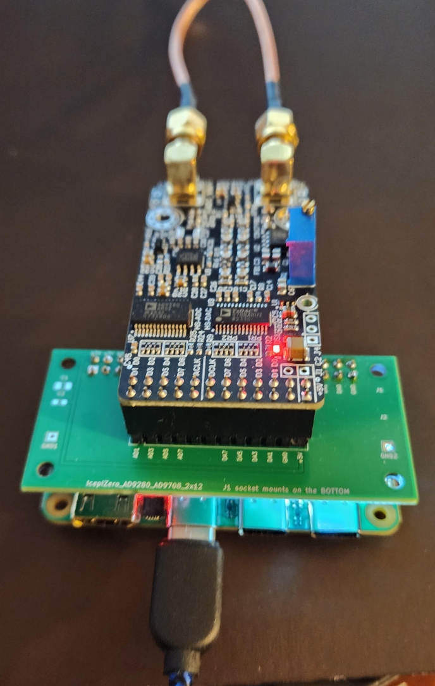
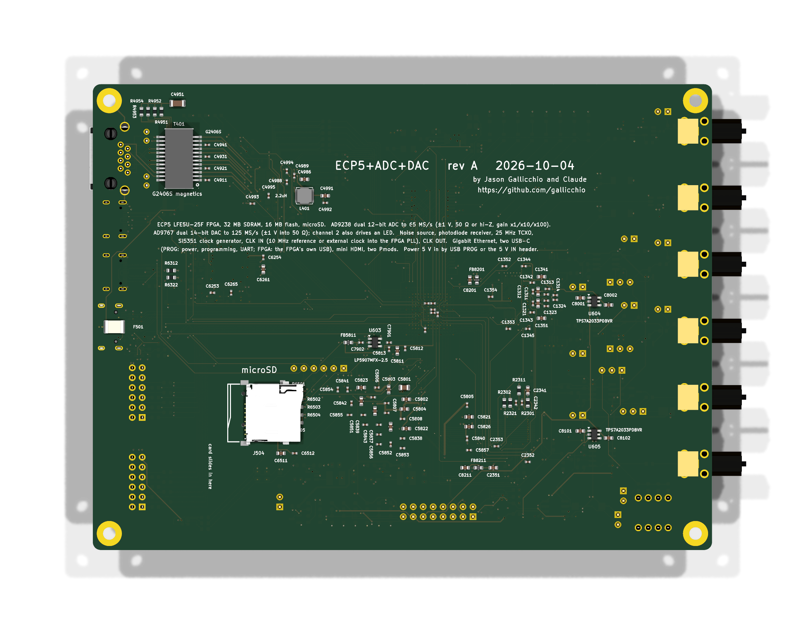

<!-- nav -->
[← 7.07 Bigger ideas: NMR, MRI and qubits](7_07_bigger_ideas.md#707-bigger-ideas-nmr-mri-and-qubits) &emsp;&emsp;&emsp; **[Contents](../README.md#contents)** &emsp;&emsp;&emsp; [Appendix B. Troubleshooting →](B_troubleshooting.md#appendix-b-troubleshooting)

# Appendix A. Why this hardware?

The goals:

* an FPGA with an open-source toolchain that runs on every laptop;
* open-hardware boards;
* a fast ADC and DAC that are easy to drive, for physics and communications
  experiments;
* and enough FPGA to boot Linux.

The hardware chosen:

* the [Icepi Zero](https://github.com/cheyao/icepi-zero): a Lattice ECP5 FPGA,
  SDRAM, and USB-C programming built in;
* an [AD9280](https://www.analog.com/en/products/ad9280.html) ADC (8 bits, up
  to 32 MS/s) and an [AD9708](https://www.analog.com/en/products/ad9708.html)
  DAC (8 bits, up to 125 MS/s), on an
  [AD9280 AD9708 data acquisition board](https://www.amazon.com/dp/B0C8D6JQSC)
  that adds an op-amp front end to each;
* and a custom PCB between them, [the adapter](../adapter_board/). (Sorry
  that this is one more thing to order.)

**Why the Icepi Zero?** Lattice makes the FPGAs that work best with the
open-source toolchains, which run on Linux, macOS and Windows. The ECP5 is big
enough to hold an open-source RISC-V processor as a customizable system on a
chip that boots Linux, via
[linux-on-litex-vexriscv](https://github.com/litex-hub/linux-on-litex-vexriscv).
The Icepi Zero is in stock for $79 at
[Elecrow](https://www.elecrow.com/icepi-zero.html) and
[Mouser](https://www.mouser.com/).

FPGA boards considered and rejected:

* [Radiona ULX3S](https://github.com/ulx3s): the flagship, and similar, but
  $140–275.
* [OrangeCrab](https://github.com/orangecrab-fpga/orangecrab-hardware): more
  powerful, with faster DDR3 RAM, but more expensive, and hard to buy.
* [Colorlight](https://github.com/wuxx/Colorlight-FPGA-Projects) boards: not
  enough RAM for Linux, and a flaky serial loader. This project started here.
* [iCESugar-Pro](https://github.com/wuxx/icesugar-pro), $72: probably the same
  flaky Muse Lab boot loader.
* [Sipeed Tang Primer 20K](https://github.com/sipeed/TangPrimer-20K-example),
  $53: LiteX-Boards' own target for it refuses the open `apicula` toolchain
  whenever the DRAM is used (`assert not (toolchain == "apicula" and with_dram)`
  in `litex_boards/targets/sipeed_tang_primer_20k.py`), so Linux on it needs
  Gowin's proprietary tools.

**Why the AD9280 and AD9708?** These modules are everywhere, cheap ($30–50),
fast, and easy to drive from an FPGA: a parallel bus and a clock. They are only
8 bits.

The next step up would be something like 2 × AD9226 ADCs (12 bits at 65 MS/s)
and 2 × AD9767 DACs (14 bits at 125 MS/s, the DAC of the Red Pitaya below), on
one PCB with the FPGA. That board is in the works.

Fancier alternatives to this whole system, open source but relying on
proprietary Xilinx tools:

* [ADALM2000](https://wiki.analog.com/university/tools/m2k) ("M2k"): $100
  used, $260 new.
* [Red Pitaya](https://redpitaya.com/), the flagship open FPGA + ADC + DAC
  board, with 2 × 14 bits at 125 MS/s: $200 used, $500 new.
* [Digilent Eclypse Z7](https://digilent.com/shop/eclypse-z7) ($524) with a
  [Zmod Scope](https://digilent.com/reference/zmod/scope/start) ($262) and a
  [Zmod AWG](https://digilent.com/shop/zmod-awg-1411-2-channel-14-bit-arbitrary-waveform-generator-awg-module/)
  ($104): a fancier module approach, but $900.

## Coming soon… hopefully

Everything in this tutorial was built around a $79 development board and a
$30 converter module, and the seams show: one ADC, one DAC, 8 bits, no
anti-alias filter, an input range of ±4 V that no antenna will ever fill,
and a USB serial port as the only way out. The board above is what Claude and I drew for the next level. It is a
158 × 119 mm six-layer board with the same ECP5 (an LFE5U-25F, so every
design here still fits), 32 MB of SDRAM, 16 MB of flash, gigabit Ethernet
(for Chapter 3's Linux, and for streaming samples faster than a [UART](https://en.wikipedia.org/wiki/Universal_asynchronous_receiver-transmitter) ever
will), an FT2232H for JTAG and serial on one USB-C and a second USB-C
straight into the FPGA, mini-HDMI, microSD, two Pmods, and the analog part
that is the point: two DC-coupled 12-bit 65 MS/s ADC channels (AD9238,
±1 V, 50 Ω or high impedance, gain ×1/×10/×100) behind proper amplifiers,
two DC-coupled 14-bit 125 MS/s DAC channels (AD9767, ±1 V into 50 Ω), an
on-board noise source, an LED driver and a [photodiode](https://en.wikipedia.org/wiki/Photodiode) receiver for the
optical lock-in experiments of [4.07](4_07_optical_link.md#407-an-optical-link),
a 25 MHz TCXO and an Si5351 clock generator, and a clock input so that two
boards, or a board and a [GPS-disciplined](https://en.wikipedia.org/wiki/GPS_disciplined_oscillator) reference, can share one clock
([5.01](5_01_two_clocks.md#501-two-clocks)'s problem, solved in copper). Two
channels in and two out is what [6.13](6_13_more_ideas.md#613-more-ideas-and-a-radar-chapter)'s
MIMO and angle-of-arrival ideas, and Chapter 7's NMR, need. Twelve bits
is 24 dB more dynamic range than eight. The design files are generated by
a script, not drawn by hand, and are open hardware like the adapter board
in this repository.

Coming soon. Hopefully. (It is rev A, dated 2026-10-04, and has not been
manufactured; when it exists and works, this tutorial gets a second
edition with two of everything.)

<!-- nav -->
[← 7.07 Bigger ideas: NMR, MRI and qubits](7_07_bigger_ideas.md#707-bigger-ideas-nmr-mri-and-qubits) &emsp;&emsp;&emsp; **[Contents](../README.md#contents)** &emsp;&emsp;&emsp; [Appendix B. Troubleshooting →](B_troubleshooting.md#appendix-b-troubleshooting)

<!-- author -->
Jason Gallicchio, jason@hmc.edu, Harvey Mudd College
